class: inverse, center, middle

```{r setup, include=FALSE}
options(htmltools.dir.version = FALSE, crayon.enabled = TRUE)
library(crayon)
library(fansi)
library(dplyr)
library(ggplot2)
library(stargazer)
library(countdown)
```

<style type="text/css">

.hljs-github .hljs {
    background: #e5e5e5;
}

.inline-c, remark-inline-code {
   background: #e5e5e5;
   border-radius: 3px;
   padding: 4px;
   font-family: 'Source Code Pro', 'Lucida Console', Monaco, monospace;
}


.yellow-h{
   background: #ffff88;
}


.out-t, remark-inline-code {
   background: #9fff9f;
   border-radius: 3px;
   padding: 4px;
   
}

.pull-left-c {
    float: left;
    width: 58%;
    
}

.pull-right-c {
    float: right;
    width: 38%;
    
}

.medium {
    font-size: 75%
    
}

.small {
    font-size: 50%
    }

.action {
    background-color: #f2eecb;
  
}


</style>


# Working with Twitter Data in R

<br>

### Resul Umit

### February 2021

.footnote[

[Skip intro &mdash; To the contents slide](#contents-slide).]

---
## Who am I?

Resul Umit

- post-doctoral researcher at the University of Oslo

- interested in representation, elections, and parliaments
    - [a recent publication](https://doi.org/10.1177%2F1478929920967588):
    Parliamentary communication allowances do not increase electoral turnout or incumbents’ vote share

--

- working with Twitter data
    - [a publication based on Twitter data](https://doi.org/10.1080/13572334.2017.1283166): The voices of Eurosceptic members of parliament (MPs) echo disproportionately louder on Twitter
    
      - 400,000+ tweets from 1,000+ MPs
      - automated classification, using a bag-of-words approach
      - manual validation
      
    - [an app based on Twitter data](https://resulumit.shinyapps.io/likewise/): LikeWise &mdash; a *Shiny* app that facilitates searching the tweets a user liked

--

- more information available at [resulumit.com](https://resulumit.com/)

---
## The Workshop &mdash; Overview

- Two days, on how to collect, process, and analyse data from Twitter

  - 150+ slides, 75+ exercises
  - support for applications to Twitter, developing real projects

--

<br>

- Designed for researchers with basic knowledge of R programming language

  - does not cover programming with R
      - e.g., writing functions    
<br>
  - existing ability to work with data in R will be very helpful
      - but not absolutely necessary &mdash; this ability can be developed during and after the workshop as well
        
---
## The Workshop &mdash; Motivation

- Twitter provides attractive opportunities for academic research

  - a simple search for "twitter data" returns 55,000+ results on Google Scholar
     - by the end of 2020

--

<br>

- Research based on Twitter data requires a set of skills 

  - typically, these skills are not part of academic training


---
## The Workshop &mdash; Motivation &mdash; Opportunities

- Popularity of the network

  - about 350 million users, more than half are daily active
  - your subjects are likely Twitter users
     - e.g., for me, members of parliament

---
## The Workshop &mdash; Motivation &mdash; Opportunities

- Popularity of the network

  - about 350 million users, more than half are daily active<sup>*</sup>
  - your subjects are likely Twitter users
     - e.g., for me, members of parliament

<br>

- Richness of the data

  - about 500 million tweets per day<sup>*</sup>
  - with up to 90 variables for each tweet


.footnote[

<sup>*</sup> These statistics are compiled at the end of 2020, by [BusinessOfApps](https://www.businessofapps.com/data/twitter-statistics).

]

---
## The Workshop &mdash; Motivation &mdash; Opportunities

- Popularity of the network

  - about 350 million users, more than half are daily active
  - your subjects are likely Twitter users
     - e.g., for me, members of parliament

<br>

- Richness of the data

  - about 500 million tweets per day
  - with up to 90 variables for each tweet

<br>

- Accessibility of the data

  - most Twitter data are public
     - i.e., relatively few private profiles   
<br>
  - APIs (application programming interfaces) enable programmatic access to Twitter
     - e.g., downloading tweets with R, as opposed to viewing tweets as visualised via browsers

---
## The Workshop &mdash; Motivation &mdash; Challenges

- Research based on Twitter data requires certain skills

  - e.g., availability of API is meaningless for researchers who cannot code yet
  - processing and analysing data are no less challenging without programming skills

--

<br>

- The required skills are often uncovered in the academic training of social scientists

  - e.g., methodology courses
  - but help is available elsewhere, including        
<br>
      - collaboration with researchers with the skills
         - at the cost of sacrificing some control over your research and research agenda   
<br>
      - acquiring the skills through individual effort
         - e.g., workshops such as this one

---
## The Workshop &mdash; Motivation &mdash; Aims

- To provide you with an understanding of what is possible

  - we will cover a large breath of issues, not all of it is for long-term memory
      - hence the slides are designed for self study as well    
<br>
  - awareness of what is possible, `Google`, and perseverance are all you need

--

<br>

- To start you with acquiring and practicing the skills needed 

  - practice with ready-written code
  - start working on a real project

---
name: contents-slide

## The Workshop &mdash; Contents

.pull-left[

[Part 1. Preliminary Considerations](#part1)
   - e.g., considering Twitter for research

[Part 2. Getting the Tools Ready](#part2)
   - e.g., downloading course material

[Part 3. Data Collection](#part3)
   - e.g., acquiring a user's tweets
   
[Part 4. Data Preperation](#part4)
   - e.g., creating a tidy dataset of tweets
   
]

.pull-right[
   
[Part 5. Data Anaysis: Users](#part5)
   - e.g., conducting network analysis
   
[Part 6. Data Anaysis: Tweets](#part6)
   - e.g., conducting sentiment analysis
   
[Part 7. Data Anaysis: Machiene Learning](#part7)
   - *To be added*
   
[Part 8. Next Steps](#part8)
   - e.g., applying for a developer account  
   
]

.footnote[

[To the list of references](#reference-slide).

] 

---
## The Workshop &mdash; Organisation

- Sit in groups of two

  - participants learn as much from their partner as from instructors
  - switch partners after every part

<br> 
- Type, rather than copy and paste, the code that you will find on these slides

  - typing is a part of the learning process

<br> 
- When you have a question

  - ask your partner
  - google together
  - ask me

---
class: action

## The Workshop &mdash; Organisation &mdash; Slides

Slides with this background colour indicate that your action is required, for

- setting the workshop up
    - e.g., installing R 
    
- completing the exercises
    - e.g., downloading tweets
    - there are 75+ exercises
    - these slides have countdown timers
        - as a guide, not to be followed strictly
    
`r countdown(minutes = 3, seconds = 00, top = 0)`

---
## The Workshop &mdash; Organisation &mdash; Slides

- Codes and texts that go in R console or scripts .inline-c[appear as such &mdash; in a different font, on gray background]    

    - long codes and texts will have their own line(s)

```{r, demonstration, eval=FALSE}
# read in  the tweets dataset
df <- read_rds("tweets.rds") %>%
  
# split the variable text, create a new variable called da_tweets   
  unnest_tokens(output = da_tweets, input = text, token = "tweets") %>%
 
# remove rows that match any of the stop words as stored in the stop_words dataset 
  anti_join(stop_words, by = c("da_tweets" = "word")) 
```

---
## The Workshop &mdash; Organisation &mdash; Slides

- Codes and texts that go in R console or scripts .inline-c[appear as such &mdash; in a different font, on gray background]    

    - long codes and texts will have their own line(s)

<br>

- Results that come out as output .out-t[appear as such &mdash; in the same font, on green background]    

    - except very obvious results, such as figures and tables
    
--

<br>

    
- Specific sections are .yellow-h[highlighted yellow as such] for emphasis

    - these could be for anything &mdash; codes and texts in input, results in output, and/or texts on slides
    
--

<br>

- The slides are designed for self-study as much as for the workshop

    - *accessible*, in substance and form, to go through on your own

---
name: part1
class: inverse, center, middle

# Part 1. Preliminary Considerations

.footnote[

[Back to the contents slide](#contents-slide).

]

---
## Considerations &mdash; Research Questions & Hypotheses

- Ideally, we have one or more research questions, hypotheses

  - developed prior to data collection, analysis
     - based on, e.g., theory, claims, observations   
<br>
  - perhaps, even pre-registered
     - e.g., at [OSF Registries](https://osf.io/registries)

--

<br>

- Not all questions can be answered with Twitter data

  - see relevant literature for what works, what does not
     - e.g., for political science, the review by [Jungherr (2016)](https://doi.org/10.1080/19331681.2015.1132401)
        - for public health, the review by [Sinnenberg et al. (2017)](https://doi.org/10.2105/AJPH.2016.303512)

---
## Considerations &mdash; Potential Biases

There are at least two potential sources of bias in Twitter data

- sampling

  - Twitter users are not representative of the people out there
     - see, for example, [Mellon and Prosser (2017)](https://doi.org/10.1177%2F2053168017720008)    
<br>
  - Tweeting behaviour has a strategic component 
     - see, for example, [Umit (2017)](https://doi.org/10.1080/13572334.2017.1283166)


--
name: potential-biases

- mediation

  - the behaviour on Twitter is mediated through written and unwritten rules
     - e.g., there is a button to like, but no dislike
         - might systematically bias the replies towards negative   
<br>
     - e.g., the common use of the like function as a bookmark
         - what would a study of Twitter likes be measuring?

---
## Considerations &mdash; Constraints over Data Access

- Twitter has restrictions on data access

  - how much data is available to download
  - how quickly, how frequently, how far dating back *etc*.
     
--
<br>

- These restrictions vary across API types

  - e.g., [Standard v1.1](https://developer.twitter.com/en/docs/twitter-api/v1) is the most restrictive APIs
      - others first generation APIs are the [Premium v1.1](https://developer.twitter.com/en/products/twitter-api/premium-apis) and [Enterprise: Gnip 2.0](https://developer.twitter.com/en/products/twitter-api/enterprise) APIs &mdash; both with paid subscriptions
      - there are also the second generation APIs, including the newly announced [Academic Research product track](https://blog.twitter.com/developer/en_us/topics/tips/2021/enabling-the-future-of-academic-research-with-the-twitter-api.html)

--
<br>

- These restrictions also vary within APIs types, across different operations

  - e.g., collecting tweets in real time *vs*. collecting historical tweets
     - but also, collecting historical tweets from a specific user *vs*. tweets from any user

---
## Considerations &mdash; Constraints over Data Redistribution

- Twitter restricts content redistribution

   - e.g., only the tweet and/or user IDs can be made publicly available in datasets over 50,000 observations
      - e.g., not the tweets themselves
      - and no more than 1.5M IDs
         - with some exceptions for academic research   
<br>
   - see [Twitter Developer terms](https://developer.twitter.com/en/developer-terms/agreement-and-policy) for further details   

--
<br>

- Reproducibility of research based on Twitter data is limited in practice

  - i.e., reproducibility after publication, by others
  - technically, they can retrieve the same tweets with IDs
      - very demanding on reproducers
      - may even be impossible
          - e.g., some tweets, or whole accounts, might be deleted in time

---
## Considerations &mdash; Changes in the Twitter APIs

- Twitter is currently switching to a new generation of APIs

  - replacing APIs v1 with v2
      - each with various types of APIs   
<br>
  - the switch is not complete, outcome is not clear
     - see the [early access](https://developer.twitter.com/en/docs/twitter-api/early-access) options
     
--
<br>

- Twitter might change the rules of the APIs game at any anytime, again

  - making the existing restrictions more or less strict
     - e.g., while you are in the middle of data collection     
<br>
  - breaking your plans, code

  
---
## Considerations &mdash; Changes in the Twitter APIs &mdash; Notes

- Existing codes to collect tweets may or may not be affected, depending on

   - how the APIs v2 will look in the end
       - it is still a work in progress   
<br>
   - whether and how the `rtweet` package<sup>*</sup> will adopt
       - personal communication: it will support v2


.footnote[

<sup>*</sup> This is the R package that we will use to collect tweets. More details are in [Part 2](#part2). 

]   

---
## Considerations &mdash; Changes in the Twitter APIs &mdash; Notes

- Existing codes to collect tweets may or may not be affected, depending on

   - how the APIs V2 will look in the end
       - it is still a work in progress   
<br>
   - whether and how the `rtweet` package will adopt
       - personal communication: it will support V2

<br>

- Not all changes are bad

   - among others, APIs v2 introduces the [Academic Research product track](https://blog.twitter.com/developer/en_us/topics/tips/2021/enabling-the-future-of-academic-research-with-the-twitter-api.html)    
<br>
       - 'to serve the unique needs and challenges of academic researchers'
           - ranging from master's students to professors    
<br>
       - access to all public tweets
          - by up to 1.5M a month at a time
       
---
## Considerations &mdash; Law and Ethics

- It is often impossible to get users' consent

  - i.e., for collecting and analysing their data on Twitter    
<br>
  - Twitter itself has no problem with it, but others might disagree
      - e.g., your law makers, (funding and/or research) institution, subjects, conscience
    
--

<br>

- Check the rules that apply to your case
   
  - rules and regulations in your country, at your institution
  
--

<br>

- Reflect on whether using Twitter data for research is ethical

  - even where it is legal and allowed, it may not be moral

---
## Considerations &mdash; Data Storage

Twitter data frequently requires 

- large amounts of digital storage space

  - Twitter data is typically big data
      - many tweets, up to 90 variables   
<br>
  - e.g., a dataset of 1M tweets requires about 300MB 
      - when stored in R data formats

--

- private, safe storage spaces

  - due to [Twitter Developer terms](https://developer.twitter.com/en/developer-terms/agreement-and-policy)
  - but also local rules, institutional requirements

---
## Considerations &mdash; Language and Context

- Some tools of text analysis are developed for a specific language and/or context

   - e.g., dictionaries for sentiment analysis
       - might be in English, political texts, only
       
   - these may not be useful, valid for different languages, and contexts
   
--

<br>

- Some tools of text analysis are developed for general use

   - e.g., a dictionary for sentiments in everyday language
   
   - these may not be useful, valid for a specific context
      - e.g., political texts

---
name: part2
class: inverse, center, middle

# Part 2. Getting the Tools Ready

.footnote[

[Back to the contents slide](#contents-slide).

]

---
class: action

## Workshop Slides &mdash; Access on Your Browser

- Having the workshop slides<sup>*</sup> on your own machine might be helpful

  - flexibility to go back and forward on your own
  - ability to scroll across long codes on some slides

<br>

- Access at <https://resulumit.com/teaching/twtr_workshop.html>

  - will remain accessible after the workshop
  - might crash for some Safari users
      - if using a different browser application is not an option, view the [PDF version of the slides](https://github.com/resulumit/twtr_workshop/blob/master/presentation/twtr_workshop.pdf) on GitHub
  
.footnote[

<sup>*</sup> These slides are produced in R, with the `xaringan` package ([Xie, 2020](https://cran.r-project.org/web/packages/xaringan/xaringan.pdf)).

]

---
name: download-zip
class: action

## Course Materials &mdash; Download from the Internet

- Download the materials from <https://github.com/resulumit/twtr_workshop/tree/materials>

  - on the webpage, follow

> `Code -> Download ZIP`

<br>

- Unzip and rename the folder

  - unzip to a location that is not synced
     - e.g., perhaps Documents, but not Dropbox

---
## Course Materials &mdash; Overview

Materials have the following structure

```

twtr_workshop-materials
   |
   |- data
   |  |
   |  |- mps.csv
   |  |- status_ids.rds
   |  |- tweets.rds
   |
   |- analysis
   |  |
   |  |- tweet_based.Rmd
   |  |- tweet_based_answers.Rmd
   |  |- user_based.Rmd
   |  |- user_based_answers.Rmd

```
---
## Course Materials &mdash; Contents

- `data/mps.csv`

  - a dataset on the members of parliament (MPs) in the British House of Commons, at the end of January 2021
  - it includes variables on electoral results as well as Twitter usernames

<br>

- `data/status_ids.rds`

  - a dataset with a single variable: `status_id`
  - lists the status IDs of all tweets posted by the MPs listed in `mps.csv`, during January 2021
  
<br>

- `data/tweets.rds`

  - similar to `data/status_ids`, except that
      - the time period is now limited to 15 to 31 January, reducing the number of observations below 50,000, allowing for all variables to be posted online

---
## Course Materials &mdash; Contents

- `tweet_based.Rmd`

  - an R Markdown file with exercises for [Part 6](#part-6)
  - the solution to these exercises are in `tweet_based_answers.Rmd`

<br>

- `user_based.Rmd`

  - an R Markdown file with exercises for [Part 5](#part-5)
  - the solution to these exercises are in `user_based_answers.Rmd`

---
class: action

## R &mdash; Download from the Internet and Install

- Programming language of this workshop

  - created for data analysis, extending for other purposes
      - e.g., accessing APIs
  - allows for all three steps in one environment
      - collecting, processing, and analysing Twitter data
  - an alternative: [python](https://www.python.org/)

<br>

- Optional, if you have R already installed

  - consider updating your copy, if it is not up to date
     - type the `R.version.string` command in R to check the version of your copy
     - compare with the latest official release at [https://cran.r-project.org/sources.html](https://cran.r-project.org/sources.html)

<br>

- Download R from [https://cloud.r-project.org](https://cloud.r-project.org)

    - choose the version for your operating system

---
class: action

## RStudio &mdash; Download from the Internet and Install

- Optional, but highly recommended

  - facilitates working with Twitter data in R

<br>

- A popular integrated development environment (IDE) for R

  - an alternative: [GNU Emacs](https://www.gnu.org/software/emacs/)

<br>

- Download RStudio from [https://rstudio.com/products/rstudio/download](https://rstudio.com/products/rstudio/download)

  - choose the free version
  - consider updating your copy, if it is not up to date, following from the RStudio menu:

> `Help -> Check for Updates`
---
class: action
name: rstudio-project

## RStudio Project &mdash; Create from within RStudio 

- RStudio allows for dividing your work with R into separate projects

  - each project gets dedicated workspace, history, and source documents
  - [this page](https://support.rstudio.com/hc/en-us/articles/200526207-Using-Projects) has more information on why projects are recommended

<br>

- Create a new RStudio project for the existing<sup>*</sup> workshop directory `...\twtr_workshop-materials` from the RStudio menu:

> `File -> New Project -> Existing Directory -> Browse -> ...\twtr_workshop-materials -> Open`


.footnote[

<sup>*</sup> Recall that we have downloaded this earlier from GitHub. [Back to the relevant slide](#download-zip).

]

---
class: action

## R Packages &mdash; Install from within RStudio<sup>*</sup>

```{r eval=FALSE, tidy=FALSE}
install.packages(c("rtweet", "httpuv", "tidyverse", "tidytext"))
```


.footnote[

<sup>*</sup> You may already have a copy of one or more of these packages. In that case, I recommend updating by re-installing them now.

]

---
class: action

## R Packages &mdash; Install from within RStudio

```{r eval=FALSE, tidy=FALSE}
install.packages(c("rtweet", "httpuv", "tidyverse", "tidytext"))
```

- `rtweet` ([Kearney, 2020](https://cran.r-project.org/web/packages/rtweet/index.html)), for collecting tweets

    - alternatives: used to be `twitteR` ([Gentry, 2015](https://cran.r-project.org/web/packages/twitteR/index.html)), but not anymore; [running Python code in R](https://blog.twitter.com/developer/en_us/topics/tips/2020/running-the-python-package-for-search-tweets-in-r.html)

--
<br>

- `httpuv` ([Cheng & Chang, 2020](https://cran.r-project.org/web/packages/httpuv/index.html)), for API authorization

    - alternative: using your own access tokens
        - necessitates making an application through a developer
        - has advantages that we will discuss later on

---
class: action

## R Packages &mdash; Install from within RStudio

```{r eval=FALSE, tidy=FALSE}
install.packages(c("rtweet", "httpuv", "tidyverse", "tidytext"))
```

- `tidyverse` ([Wickham & RStudio 2019](https://cran.r-project.org/web/packages/tidyverse/index.html)), for various tasks

    - including data manipulation, visualisation
    - alternative: e.g., `base` R

--
<br>

- `tidytext` ([Robinson & Silge, 2021](https://cran.r-project.org/web/packages/tidytext/index.html)), for working with text as data

    - alternative: e.g., `quanteda` ([Benoit et al., 2020](https://cran.r-project.org/web/packages/quanteda/index.html))

---
## Twitter &mdash; Authorisation

Authorization to use Twitter APIs requires at least three steps<sup>*</sup>

1) open a user account on Twitter
  - a personal or an institutional (perhaps, for a research project) one
  - done once, takes minutes
      
2) with that user account, apply for a developer account
  - so that you are recognised as a developer, have access to the [developer portal](https://developer.twitter.com/en/portal)
  - done once per account, .yellow-h[takes days to get approved manually]
      
3) with that developer account, register a Twitter app
  - so that you have the keys and tokens for authorisation
  - repeated for every project, takes minutes
      
      
.footnote[

<sup>*</sup> There may be additional steps, such as registering for the [Academic Research product track](https://developer.twitter.com/en/portal/petition/academic/is-it-right-for-you).

]

---
## Twitter &mdash; Authorisation &mdash; Notes

- It is possible to interact with Twitter APIs without steps 2 and 3

  - `rtweet` has a its own Twitter app &mdash; `rstats2twitter` &mdash; that anyone can use
      - anyone with a Twitter account, who authorises `rstats2twitter` via a pop-up browser

--

<br>

- I recommend
   
   - following only the step 1 (open an account) now, which
       - you might already have done
       - is otherwise automatic
       - allows us to use `rstats2twitter` and follow the workshop   
<br>
   - leaving the remaining steps until [Part 8](#part-8)
       - to allow you to think and write your applications carefully
       - to get my feedback if you prefer to do so
       
---
class: action

## Twitter &mdash; Open an Account

Sign up for Twitter at [https://twitter.com/](twitter.com)

- a pre-condition for interacting with Twitter APIs

    - e.g., you must be authorized 
       - even to use `rtweet`'s app &mdash; `rstats2twitter`
    
<br>
- helpful for getting to know what you study

    - e.g., the written and unwritten rules that mediate the behaviour on Twitter
        - as discussed [in Part 1](#potential-biases)

<br>
- with a strategic username

  - usernames are changeable, but nevertheless public
      - either choose an anonymous username (e.g., `asdf029348`)
      - or choose one carefully &mdash; they become a part of users' online presence

---
## Other Resources<sup>*</sup>

- R for Data Science ([Wickham & Grolemund, 2019](https://r4ds.had.co.nz/))
  
   - open access at [https://r4ds.had.co.nz](https://r4ds.had.co.nz/)
   
--

<br>

- Text Mining with R: A Tidy Approach ([Silge & Robinson, 2017](https://www.tidytextmining.com/))
 
   - open access at [tidytextmining.com](https://www.tidytextmining.com/)
   - comes with [a course website](https://juliasilge.shinyapps.io/learntidytext/) where you can practice
   
--

<br>

- A Tutorial for Using Twitter Data in the Social Sciences: Data Collection, Preparation, and Analysis ([Jürgens & Jungherr, 2016](http://dx.doi.org/10.2139/ssrn.2710146))

   - open access at [http://dx.doi.org/10.2139/ssrn.2710146](http://dx.doi.org/10.2139/ssrn.2710146)
   
   
.footnote[

<sup>*</sup> I recommend these to be consulted not during but after the workshop.

]

---
name: part3
class: inverse, center, middle

# Part 3. Data Collection

.footnote[

[Back to the contents slide](#contents-slide).

]
---
## Data Collection &mdash; Overview &mdash; APIs
  
- We will collect data through APIs    

  - i.e., Twitter's [Standard v1.1](https://developer.twitter.com/en/docs/twitter-api/v1) APIs
  - provides more variables than available through browsers
  - comes with rules and restrictions
      - enforced through authentication

--
<br>

- Collecting data through web scraping is also possible    

   - e.g., with `GetOldTweets3` &mdash; [a python library](https://pypi.org/project/GetOldTweets3/)
      - scrapes, scrolls down, and scrapes again to collect all matching data   
<br>
   - does not require, is not limited by, Twitter APIs
   - limited with what is available on browsers
   - may or may not be ethical and/or legal

---
## Data Collection &mdash; Overview &mdash; APIs &mdash; Types

- .yellow-h[In general], there are two main types of APIs   

   - REST and Streaming
   - applies to APIS elsewhere, not just at Twitter
   - functions, arguments, behaviour differ slightly
   
--

<br>

- REST APIs are for single, one-off requests    

   - e.g., search for tweets posted in the last 6 to 9 days
   - but also, post or delete tweets
   
--

<br>

- Streaming APIs are for continuous requests    

   - e.g., collect tweets as they are being posted

---
## Data Collection &mdash; Overview &mdash; APIs &mdash; Types

- .yellow-h[At Twitter], there is a further differentiation among the APIs   

   - e.i., [API v2](https://developer.twitter.com/en/docs/twitter-api/early-access), [Enterprise: Gnip 2.0](https://developer.twitter.com/en/docs/twitter-api/enterprise), [Premium v1.1](https://developer.twitter.com/en/docs/twitter-api/premium), [Standard v1.1](https://developer.twitter.com/en/docs/twitter-api/v1)
   - with each, you can make single or continuous requests

--

<br>

- Rules and restrictions differ from one type to another   

  - as does the cost
  - some remove the restrictions on how much data we can access
  - restrictions on how .yellow[quickly] we can access data exist in all types
     - these restrictions are called [rate limits](https://developer.twitter.com/en/docs/rate-limits)
     
--

<br>

- Rules and restrictions can also differ within one type
 
  - for different operations  
      - e.g., for collecting historical *vs*. live data


---
## Data Collection &mdash; Overview &mdash; Standard v1.1 APIs

- We will collect data through Twitter's Standard v1.1 APIs  

  - free of charge
  - thanks to `rweet`'s `rstats2twitter` app, can be used immediately
  - comes with the strictest of restrictions
        - e.g., searches tweets posted in the last 6 to 9 days

--
<br>

- You can surpass these restrictions later on    

   - academic researchers can apply for the newly announced the [Academic Research product track](https://twitter.com/TwitterDev/status/1354143047324299264)
   - others can purchase an alternative
   - the principles of data collection are likely to remain the same
       - `rweet` has the `search_30day` and `search_fullarchive` functions for the [Premium V1.1](https://developer.twitter.com/en/products/twitter-api/premium-apis) APIs
       - the package may require an update, in line with the [Academic Research product track](https://twitter.com/TwitterDev/status/1354143047324299264)
       
---
## Data Collection &mdash; Overview &mdash; APIs &mdash; Limitations

Our attempts to collect data will be limited for various reasons, including

- the intended restrictions by Twitter
   - by the limitations of Standard v1.1
      - e.g., by rate limits
         - maximum number of requests 
         - per app, type of request, time interval

--

- any lack of tweets or users matching our search criteria
    - stricter the criteria, more likely to occur

--

- connections timing out
    - depends on type of requests, and your internet connection
    - more likely for continuous searches

--

- reasons unknown to humankind
   - sometimes things just happen

---
## Data Collection &mdash; `rtweet` &mdash; Overview

- A powerful R package for collecting Twitter data

  - created by [Michael W. Kearney](https://mikewk.com/) (University of Missouri)
  - used widely, replacing previous packages for this task
      - e.g., `twitteR`
  - last updated a year ago
      - personal communication: the package will continue to be maintained in the future

--

- A lot has already been written on this package. See, for example, 

    - the [package repository](https://github.com/ropensci/rtweet) on GitHub
    - the [package documentation](https://cran.r-project.org/web/packages/rtweet/rtweet.pdf)
    - this [journal article](https://doi.org/10.21105/joss.01829) by its creator
    - this [book](https://rud.is/books/21-recipes/) by Bob Rudis &mdash; a user of the package
    - numerous tutorials, such as [this](https://www.mzes.uni-mannheim.de/socialsciencedatalab/article/collecting-and-analyzing-twitter-using-r/), [this](https://www.r-pkg.org/pkg/rtweet), and [this](https://www.earthdatascience.org/courses/earth-analytics/get-data-using-apis/use-twitter-api-r/)

--

- Comes with its own app, `rstats2twitter`
    - allows for collecting tweets without a developer account
    - offers the option of using your own keys and tokens, if/once you have them

---
## Data Collection &mdash; `rtweet` &mdash; Basics

There are four main groups of functions to collect .yellow-h[historical] data, starting with

- **`search_`**
    - such as `search_tweets` or `search_users`
    - 4 functions, for general use
          - 2 for standard APIs, 2 for premium APIs

--
      
- **`lookup_`**
    - such as `lookup_tweets` or `lookup_users`
    - 5 functions, for expanding an existing variable into a dataset
          - e.g., starting with a list of IDs for tweets or users

--
      
- **`get_`**
    - such as `get_followers` or `get_friends`
    - 11 functions, for specific tasks

--
      
- **`lists_`**
    - such as `lists_members` or `lists_statuses`
    - 6 functions, for tasks related to [Twitter lists](https://help.twitter.com/en/using-twitter/twitter-lists#:~:text=A%20List%20is%20a%20curated,the%20accounts%20on%20that%20List.) specifically


---
## Data Collection &mdash; `rtweet` &mdash; Basics

There is also .yellow-h[one] function to collect tweets in .yellow-h[real time]

- **`stream_tweets`**

  - queries the streaming API
  - returns a small random sample of all tweets as they are posted
  - can be filtered by keywords, users, and/or locations

--

<br>

- For other functions, see the [package documentation](https://cran.r-project.org/web/packages/rtweet/rtweet.pdf)

  - e.g., the functions starting with `post_`
      - allowing for posting your tweets, direct messages, from within R 
      
---
class: action

## Data Collection &mdash; Start Your Script

.pull-left[

- Check that you are in the right project
    - created in [Part 2](#part2)
    - indicated at the upper-right corner of RStudio window

- Create a new R Script, following from the RStudio menu

> `File -> New File -> R Script`

- Name and save your file
    - to avoid the `Untitled123` problem
    - e.g., `data_collection.R`


- Load the `rtweet` and other packages
   - no need to load the `httpuv` package, enough if installed

]

.pull-right[

```{r, eval=FALSE}
library(rtweet)
library(tidyverse)
library(tidytext)
```

]

---
class: middle, center

# `search_`

---
## Data Collection &mdash; `search_tweets`

.pull-left[

Collect tweets posted in the last 6 to 9 days
- filter by search query, with the `q` argument

- limited to 18,000 tweets, per 15 minutes, per token<sup>*</sup>
    - set the limit, higher or lower, with the `n` argument<sup>**</sup>
        - works best the multiples of 100   
<br>
    - if set higher, wait automatically by setting the `retryonratelimit` argument to `TRUE`


]

.pull-right[

```{r, eval=FALSE}
search_tweets(q,
              n = 100,
              type = "recent",
              include_rts = TRUE,
              geocode = NULL,
              max_id = NULL,
              parse = TRUE,
              token = NULL,
              retryonratelimit = FALSE,
              verbose = TRUE,
              ...
)
```


]


.footnote[

<sup>*</sup> All limits are for the standard v1.1 APIs.

<sup>**</sup>This argument is common to many functions in the package. I recommend setting it to a small number, such as 200, for the exercises in this workshop. This will save computation time and avoid running into rate limits.

]

---
## Data Collection &mdash; `search_tweets`

.pull-left[

- Collect the .yellow-h[latest] 100 tweets that
    - include the hashtag "publish"

<br>

- Note that
  - by default, `type = "recent"`, returning the latest tweets
     - other options are "popular" and "mixed"    
<br>
  - by default, `n = 100`, returning 100 tweets
<br>
  - here we are relying on `rtweet`'s `rstats2twitter` app
      - as, by default, `token = NULL`

]


.pull-right[


```{r, eval=FALSE}
```{r, eval=FALSE}
search_tweets(q = `"#publish"`)
```

]

---
class: action

## Exercises

1) Collect the top 300 tweets that 
- include the hashtag "AcademicTwitter"
- and assign the resulting data frame to `df_tweets`
   - so that you can observe the results with ease
   - hence, I recommend doing the same for all APIs searches that follow

2) Observe how the `rstats2twitter` app works
  - when you call the function, pay attention to what happens on your R console and on your default browser
     - this will happen only once per R session
  
3) Take some time to explore the data frame
- see which variables are in there, and how they are called
- think about how you could use these variables for research
- hint: use functions like `View`, `str`, `names`, `tibble::glimpse`


4) Conduct the same search on a browser
- using the [advanced search form](https://twitter.com/search-advanced)
- compare and contrast the API- and browser-based searches

    
`r countdown(minutes = 15, seconds = 00, top = 0)`

---
## Data Collection &mdash; Notes

- Twitter usernames, or handles, are stored under variable `screen_name`

   - can be misleading, as users also have display names

--

- Twitter allows user to change their usernames and display names

   - user IDs, however, do not change
      - `user_id` is a better variable for reproducible research

--

- The date and time data are matched to Greenwhich Mean Time

   - stored under the variable `created_at`
   - no matter where users actually are at the time of tweeting

--

- You may wish to exclude retweets

   - depending on the research question and design
   - by setting `include_rts = FALSE`

---
## Data Collection &mdash; `search_tweets`

.pull-left[

Collect the .yellow-h[top] .yellow-h[200] tweets that
- include the .yellow-h[word] "publish"

]


.pull-right[


```{r, eval=FALSE}
search_tweets(q = `"p`ublish",
              `n = 200`,
              `type = "popular"`)
```

]

---
## Data Collection &mdash; `search_tweets`

.pull-left[

- Collect the top 200 tweets that
  - include the word "publish" .yellow-h[and] "perish", not necessarily in that order

<br>

- Note that
  - space is treated as the boolean AND operator

]


.pull-right[


```{r, eval=FALSE}
search_tweets(q = `"publish perish"`,
              n = 200,
              type = "popular")
```

]

---
## Data Collection &mdash; `search_tweets`

.pull-left[

- Collect the top 200 tweets that
  - include the word "publish" .yellow-h[or] "perish"

<br>

- Note that
  - the boolean OR operator must be specified, in capital letters

]


.pull-right[


```{r, eval=FALSE}
search_tweets(q = `"publish OR perish"`,
              n = 200,
              type = "popular")
```

]

---
## Data Collection &mdash; `search_tweets`

.pull-left[

- Collect the top 200 tweets that
  - include the .yellow-h[exact phrase]  "publish or perish"

<br>

- Note that
 - double quotation marks .yellow-h["] need to be escaped with a backslash .yellow-h[&#92;]

]


.pull-right[


```{r, eval=FALSE}
search_tweets(q = "`\"`publish or perish`\"`",
              n = 200,
              type = "popular")
```

]

---
## Data Collection &mdash; `search_tweets`

.pull-left[

- Collect the top 200 tweets that
  - include "publish" but not "perish"
  
<br>

- Note that
  - words can be negated with a hyphen .yellow-h[-]

]


.pull-right[


```{r, eval=FALSE}
search_tweets(q = "publish `-perish`",
              n = 200,
              type = "popular")
```

]

---
## Data Collection &mdash; `search_tweets`

.pull-left[

- Collect the top 200 tweets that
  - include "publish", and
  - are otherwise written .yellow-h[in German]

<br>


]


.pull-right[


```{r, eval=FALSE}
search_tweets(q = "publish `lang:de`",
              n = 200,
              type = "popular")
```

]

- Note that   
  - query parameters, such as `lang`, are followed by a colon .yellow-h[&#58;]
      - other parameters include `filter`, `from`, `to`, `since`, `until`, `min_retweets` *etc*.   
<br>
  - there is an official guide for [a comprehensive but not complete list of search operators](https://developer.twitter.com/en/docs/twitter-api/v1/tweets/search/guides/standard-operators)
      - alternatively, fill in [this advanced search form](https://twitter.com/search-advanced), and observe the resulting syntax

---
## Data Collection &mdash; `search_tweets`

.pull-left[

Collect the top 200 tweets that
- include "publish", and
- are .yellow-h[not] in German

Note that
- operators can be negated with a hyphen as well

]


.pull-right[


```{r, eval=FALSE}
search_tweets(q = "publish `-`lang:de",
              n = 200,
              type = "popular")
```

]

---
## Data Collection &mdash; `search_tweets` &mdash; Notes

.pull-left[

- .yellow-h[Some] query parameters can be passed into the function as arguments as well
  - e.g., `lang`, `filter`

<br>

- Note that
  - these functions on the right return the same observations
  - there are slight differences in syntax, such as
    - `lang:en` as a parameter
    - `lang = "en"` as an argument

]


.pull-right[


```{r, eval=FALSE}
search_tweets(q = "publish lang:en filter:replies",
              n = 200,
              type = "mixed")
```

```{r, eval=FALSE}
search_tweets(q = "publish",
              n = 200,
              type = "mixed",
              lang = "en", 
              filter = "replies")
```

]

---
## Data Collection &mdash; `search_tweets` &mdash; Notes

- This function returns a data frame

  - as do many other functions in the package
  - because, by default, `parse = TRUE`

<br>

- Under the hood, Twitter APIs return nested lists

  - nested lists can be tidied into rectangular shape, but not tidy data as they are returned
  - `rtweet` does most of the data preparation for us

---
class: action

## Exercises

5) Collect the latest 200 tweets that include
- the phrase "publish or perish"
- and the word "academia" but not the word "phd"

<br>

6) Collect the most recent 200 tweets that
- include the word "Luzern"
- sent within 25 mile radius around Lucerne city centre
- excluding retweets
- hint: pull the help file for the function to see which arguments you can use
   - get help from Google about the coordinates

<br>

7) Collect the most recent 35,000 tweets that
- include the word "phd"
- note that this is over the limit of 18,000
- hint: pull the help file for the function to see which argument you must use to surpass the limit

`r countdown(minutes = 20, seconds = 00, top = 0)`

---
## Data Collection &mdash; `search_users`

.pull-left[
- Collect information on users

  - filter usernames, names, bios
  - by search query with the `q` argument
  - returns information from recently active users 
  - limited to 1,000 users

    
<br>

- Note that

  - there is no `retryonratelimit` argument
  - you can still use the [complete list of search operators](https://developer.twitter.com/en/docs/twitter-api/v1/tweets/search/guides/standard-operators) and [this advanced search form](https://twitter.com/search-advanced) for help with queries
    
]

.pull-right[

```{r, eval=FALSE}
search_users(q, 
             n = 100, 
             parse = TRUE, 
             token = NULL, 
             verbose = TRUE)
```

]
    
---
class: action

## Exercises

8) Collect information on 300 users that 
- are associated with the word "PhD"
- but not with the word "rstats"

<br>

9) Collect the latest 300 tweets that 
- include the word "PhD"
- but not the word "rstats"

<br>

10) Take some time to explore the resulting data frames
- how do they compare to each other? 

<br>

11) Conduct one or more searches that interest you
- for tweets and/or users

`r countdown(minutes = 20, seconds = 00, top = 0)`


---
## Data Collection &mdash; Notes &mdash; `rate_limit`

.pull-left[

- Check rate limits at any time

   - for all operations
   - for a specific operation
      - e.g., searching tweets with the `search_tweets` function
  
<br>

- Note that 

  - if no token is specified, the function uses the `rstats2twitter` app
  - rate limits decrease as you use them, increase again after a time threshold
  - [Twitter Developer terms](https://developer.twitter.com/en/developer-terms/agreement-and-policy) do not allow for multiple tokens to be used for the same project

]

.pull-right[

```{r, eval=FALSE}
rate_limit(token = NULL, 
           query = NULL, 
           parse = TRUE)
```

]

---
## Data Collection &mdash; Notes &mdash; `rate_limit`

Check you remaining rate limits, for all operations

```{r, eval=FALSE}
rate_limit()
```

--

<br>

Check your remaining rate limits for the `search_tweets` function


```{r, eval=FALSE}
rate_limit(`query = "search/tweets"`)
```

---
class: action

## Exercises

12) Check all your remaining rate limits
- hint: assign the call `rate_limit` to a name 
   - so that you can observe the resulting data frame better

<br> 

13) Check your remaining limits for the `search_tweets` function
   - assign it to a name so that you can remember

<br>

14) Collect the top 5000 tweets that 
- include the word "PhD"
- and posted by a verified account

<br>

15) Check your remaining limits for the `search_tweets` function again
- how do they compare to the results from exercise 13? 

`r countdown(minutes = 10, seconds = 00, top = 0)`

---
class: middle, center

# `lookup_`

---
## Data Collection &mdash; `lookup_tweets`

.pull-left[

- Collect data on one or more tweets

   - whose status ID you already know
   - limited with 90,000 posts per 15 minutes
      - there is no `retryonratelimit` argument
      
<br>
- Note that

   - this function would be useful for replicating studies
   - status IDs are visible on browsers
      - if you click on a specific tweet
]


.pull-right[

```{r, eval=FALSE}
lookup_tweets(statuses, 
              parse = TRUE, 
              token = NULL)
```

]

---
## Data Collection &mdash; `lookup_tweets`

Collect data on one or more status IDs 

```{r, eval=FALSE}
lookup_tweets(statuses = c("567053242429734913", "266031293945503744", "440322224407314432"))
```

--
<br>

Collect data on status IDs .yellow[in a data frame] 

```{r, eval=FALSE}
lookup_tweets(statuses = df$status_id)
```

---
## Data Collection &mdash; `lookup_users`

.pull-left[

- Collect data on one or more users 

   - whose user ID or username you already know
   - limited with 90,000 users per 15 minutes
      - there is no `retryonratelimit` argument

<br>

- Note that

   - usernames can change
   - rely on user IDs where possible
]

.pull-right[

```{r, eval=FALSE}
lookup_users(users, 
             parse = TRUE, 
             token = NULL)
```

]

---
## Data Collection &mdash; `lookup_users`

Collect data on one or more status IDs 

```{r, eval=FALSE}
lookup_users(users = c( "drob", "hadleywickham", "JennyBryan"))
```

--
<br>

Collect data on status IDs .yellow[in a data frame] 

```{r, eval=FALSE}
lookup_users(users  = df$screen_name)
```

---
## Data Collection &mdash; `lookup_friendships`

.pull-left[

- Collect data on friendship status of two users

   - e.g., whether they follow each other 
   - whose user ID or username you already know
   - limited with 90,000 users per 15 minutes
      - there is no `retryonratelimit` argument

<br>

- Note that

   - usernames can change
   - rely on user IDs where possible
]

.pull-right[

```{r, eval=FALSE}
lookup_friendships(source, 
                   target, 
                   parse = TRUE, 
                   token = NULL)
```

]

---
class: action

## Exercises

16) Find a status ID through your browser and look it up in R
 - they appear in search bar when viewing a single tweet
 - unlike user IDs

<br>

17) Look up a subset of tweets whose ids stored in `status_ids.rds` 

<br>

18) Look up a subset of users whose usernames stored in `mps.csv`

<br>

19) Check the friendship status of two MPs in the dataset
- hint: not all MPs are on Twitter, but most are
    - e.g., check if the 10<sup>th</sup> and 20<sup>th</sup> observations follow each other

`r countdown(minutes = 15, seconds = 00, top = 0)`


---
class: middle, center

# `get_`

---
## Data Collection &mdash; `get_timeline`

.pull-left[

- Collect the latest posts from one or more users

  - specified by username or user IDs, with the `user` argument
  - limited to 3,200 tweets per user-timeline  
      - there is no `retryonratelimit` argument
  - returns the most recent only, if there is more

]
    
.pull-right[

```{r, eval=FALSE}
get_timeline(user,
             n = 100,
             max_id = NULL,
             home = FALSE,
             parse = TRUE,
             check = TRUE,
             token = NULL,
             ...
)
```

]

---
## Data Collection &mdash; `get_timeline`


.pull-left[

Collect the most recent 200 tweets by David Robinson
- e.i., tweets from the user-timeline of .yellow-h[one] user

]


.pull-right[


```{r, eval=FALSE}
search_tweets(user = "drob",
              n = 200)
```

]

---
## Data Collection &mdash; `get_timeline`


.pull-left[

- Collect the most recent posts by David Robinson .yellow-h[and] Hadley Wickham

  - tweets from the user-timeline of .yellow-h[multiple] users 

<br>

- Note that
  
  - this results in a dataframe of 400 observations
  - 200 from each specified user
  - with increasing number of users, you are likely to run out of rate limit

]


.pull-right[


```{r, eval=FALSE}
get_timeline(user = `c("drob",`
                     `"hadleywickham")`,
             n = 200)
```

]

---
## Data Collection &mdash; `get_timeline` &mdash; Home Timeline

.pull-left[

- The [package documentation](https://cran.r-project.org/web/packages/rtweet/rtweet.pdf) suggests that `get_timeline` can also retrieve home-timelines
    - i.e., the tweets that appear on a given user's home, as posted by accounts followed by that user
        - if the `home` argument is set to `TRUE`

- This does not seem to be true
    - this code returns your home-timeline, not Wickham's
        - from the last 6 to 9 days
    - the `user` argument is ignored when `home = TRUE`
    - but the `user` argument cannot be missing

]


.pull-right[


```{r, eval=FALSE}
get_timeline(`user = "hadleywickham"`,
             n = 200, 
             `home = TRUE`)
```

]

---
## Data Collection &mdash; Notes &mdash; `retryonratelimit`

- the `retryonratelimit` argument is not available for all functions in the package

  - e.g., `search_users`
  - does not mean you will not run into limits
    
--

<br>

- You can create your own safety net

   - e.g., with loops, where the system sleeps between iterations
     - until a specific rate limit increases

---
## Data Collection &mdash; Notes &mdash; `retryonratelimit` &mdash; Iteration


```{r, eval=FALSE}
datalist <- list() # create an empty list, to be filled later

for(i in 1:length(df_users$screen_name)) { # for one user, in the data frame df_users, at a time
  
  if (rate_limit(query = "application/rate_limit_status", token = tw_token)$remaining > 2 &
      rate_limit(query = "get_timeline", token = tw_token)$remaining > 20) { # if your are still under rate limit for this task
    
  dat <- get_timeline(df$screen_name[i], n = 3200, # collect the tweets
                      token = tw_token)
  
  datalist[[i]] <- dat # fill the list with data, for one user at a time
  
  }else{ # if there is no limit, wait a little
    
  wait <- rate_limit(query = "get_timeline")$reset + 0.1
  Sys.sleep(wait * 60)
    
  }
}

df_tweets <- as.data.frame(do.call(rbind, datalist)) # put all data in one data frame
```


---
class: action

## Exercises

20) Collect the most recent tweets posted by three users 
- 100 from the first user, 200 from the second, and 300 from the third
- hint: see the function documentation on how to vary the `n` argument by user

<br>

21) Collect as many tweets as possible from your own home-timeline

<br>

22) Collect data from timelines of the first five MPs in `mps.csv`
- collect as many tweets as possible

`r countdown(minutes = 10, seconds = 00, top = 0)`

---
## Data Collection &mdash; `get_followers`

.pull-left[

- Collect a list of followers, following .yellow-h[one] user

  - returns a single column of user IDs, not usernames
  - limited with 75,000 followers per 15 minutes
      - use `retryonratelimit = TRUE` to surpass the limit

<br>     
- Note that

   - this function does not accept multiple users
   - it can be combined with `lookup_users` if usernames are needed

]


.pull-right[
```{r, eval=FALSE}
get_followers(user,
              n = 5000,
              page = "-1",
              retryonratelimit = FALSE,
              parse = TRUE,
              verbose = TRUE,
              token = NULL
)
```
]

---
## Data Collection &mdash; `get_followers`

Collect a list of Hadley Wickham's followers on Twitter

```{r, eval=FALSE}
get_followers(user = "hadleywickham",
              n = 10000,
              retryonratelimit = TRUE)
```

---
## Data Collection &mdash; `get_friends`

.pull-left[

Get a list of users, .yellow-h[followed by] .yellow-h[one or more] users

- this returns a single column of user IDs, not usernames
- limited to 15 users
      - use `retryonratelimit = TRUE` to surpass the limit   
<br>
- limited also to 5,000 followers per user
      - here `retryonratelimit = TRUE` does not help   
<br>
- use the `page` argument instead to surpass the limit
      - learn the correct value with the `next_cursor` argument
]


.pull-right[


```{r, eval=FALSE}
get_friends(users,
            n = 5000,
            retryonratelimit = FALSE,
            page = "-1",
            parse = TRUE,
            verbose = TRUE,
            token = NULL
)
```

]

---
## Data Collection &mdash; `get_friends`

Collect a list of users followed by Jenny Bryan and Hadley Wickham on Twitter
   - with 20 friends from each

```{r, eval=FALSE}
get_friends(users = c("hadleywickham", "JennyBryan"),
            n = 20)
```

---
class: action

## Exercises

23) Collect a list of accounts following *Universität Luzern*
- search for the Unversity's username with `search_users`
- search for the followers `get_followers`

<br>

24) Collect a list of accounts that *Universität Luzern* follows
- find out more about these accounts with `lookup_users`
   - hint: use `df_friends$user_id` as the `users` argument
   
<br>
   
25) Check your rate limits

`r countdown(minutes = 7, seconds = 30, top = 0)`

---
## Data Collection &mdash; `get_favorites`

.pull-left[

Collect tweets liked by one or more users

  - by username or user IDs, with the `user` argument
  - limited to 3,000 likes
      - there is no `retryonratelimit` argument
  - returns the most recent only, if there is more

]


.pull-right[


```{r, eval=FALSE}
get_favorites(user,
              n = 200,
              since_id = NULL,
              max_id = NULL,
              parse = TRUE,
              token = NULL
)
```

]

---
## Data Collection &mdash; `get_favorites`

Collect a list of tweets liked by Jenny Bryan

```{r, eval=FALSE}
get_favorites(user = "JennyBryan")
```


---
## Data Collection &mdash; `get_retweets`

.pull-left[

- Collect information on the retweets of .yellow-h[one] tweet

   - using the `status_id` argument
   - available in the data frames returned by many functions in the package
       - e.g., `get_timeline`
        - also available on browsers    
<br>
   - limited to 100 retweets
      - even if there might be more


]

.pull-right[

```{r, eval=FALSE}
get_retweets(status_id, 
             n = 100, 
             parse = TRUE, 
             token = NULL, 
             ...
)
```
]


---
## Data Collection &mdash; `get_retweets`

- Collect the most recent 50 retweets 

   - of the post announcing the [Academic Research product track](https://twitter.com/TwitterDev/status/1354143047324299264)


```{r, eval=FALSE}
get_retweets(status_id = "1354143047324299264")
```


---
class: action

## Exercises

26) Collect a list of favorites by three users
- compare and contrast the resulting data with the same information available on browser

<br>

27) Collect a list of accounts retweeting a recent tweet of yours
- compare and contrast the resulting data with what you can see on a browser

`r countdown(minutes = 7, seconds = 30, top = 0)`

---
## Data Collection &mdash; `get_trends`

.pull-left[

- Collect information on twitter trends

   - by town or country, specified with 
       - the `woeid` argument,<sup>*</sup> or 
       - the `lat` and `long` arguments

<br>       
- Note that

  - not all locations have trending data
  - use the `trends_available` function to check availability
      - with no argument

]


.pull-right[

```{r, eval=FALSE}
get_trends(woeid = 1,
           lat = NULL,
           lng = NULL,
           exclude_hashtags = FALSE,
           token = NULL,
           parse = TRUE
)
```

]

.footnote[

<sup>*</sup> It stands for "where on earth identifier", which is 44418 for London. Google for more!

]

---
## Data Collection &mdash; `get_trends`

Collect the trends data for London
 - using the `woeid` argument

```{r, eval=FALSE}
get_trends(woeid = 44418)
```


<br>

Collect the same trends data for London
 - using the `lat` and `long` arguments instead


```{r, eval=FALSE}
get_trends(lat = "51.50", lng = "0.12")
```

---
class: action

## Exercises

28) Collect a list of places where the trends data is available
- hint: use the `trends_available` function

<br>

29) Collect the lists of trends for two locations
- compare and contrast the resulting data for two locations

<br>

30) Collect the list of trends for your location
- compare and contrast the resulting data with what you see on your browser

`r countdown(minutes = 7, seconds = 30, top = 0)`

---
class: middle, center

# `lists_`

---
## Data Collection &mdash; `lists_memberships`

.pull-left[

- Collect .yellow-h[data on lists], where one or more users are listed

   - i.e., the lists where a user appears
   - limited to 200 lists

]

.pull-right[

```{r, eval=FALSE}
lists_memberships(user = NULL,
                  n = 200,
                  cursor = "-1",
                  filter_to_owned_lists = FALSE,
                  token = NULL,
                  parse = TRUE,
                  previous_cursor = NULL
)
```

]

---
## Data Collection &mdash; `lists_memberships`

Collect data on lists where Jenny Bryan is listed

```{r, eval=FALSE}
lists_memberships(user = "JennyBryan")
```

<br>

Collect data on lists where Jenny Bryan .yellow-h[and/or] Hadley Wickham is listed

```{r, eval=FALSE}
lists_memberships(user = c("JennyBryan", "hadleywickham"))
```

---
## Data Collection &mdash; `lists_members`

.pull-left[

- Collect .yellow-h[data on users] listed in .yellow-h[one] list

   - specify the list with the `list_id` argument
       - e.g., with data from `lists_memberships`
   - or the `owner_user` .yellow-h[and] `slug` arguments together
   - limited to 5,000 members
   
<br>

- Note that

  - lists also appear at twitter.com/USERNAME/lists
  - see, for example, [twitter.com/tweetminster/lists](https://twitter.com/tweetminster/lists)

]
   
.pull-right[

```{r, eval=FALSE}
lists_members(list_id = NULL,
              slug = NULL,
              owner_user = NULL,
              n = 5000,
              cursor = "-1",
              token = NULL,
              parse = TRUE,
              ...
)
```

]

---
## Data Collection &mdash; `lists_members`

Collect data on the list of MPs in the House of Commons
- using the `list_id` argument
   
```{r, eval=FALSE}
lists_members(list_id = "1405362")
```

--
<br>

Collect the same data, with different arguments
- using the `owner_user` .yellow-h[and] `slug` arguments
   
```{r, eval=FALSE}
lists_members(owner_user = "tweetminster", slug = "UKMPs")
```

---
## Data Collection &mdash; `lists_statuses`

.pull-left[

Collect tweets from the timeline of a list
   
- i.e., tweets posted by those listed on a given list
- specify the list with the `list_id` argument
- or the `owner_user` .yellow-h[and] `slug` arguments together
   
]
    
.pull-right[

```{r, eval=FALSE}
lists_statuses(list_id = NULL,
               slug = NULL,
               owner_user = NULL,
               since_id = NULL,
               max_id = NULL,
               n = 200,
               include_rts = TRUE,
               parse = TRUE,
               token = NULL
)
```

]

---
## Data Collection &mdash; `lists_statuses`

Collect tweets posted by the members of the UKMPs list
- using the `list_id` argument
   
```{r, eval=FALSE}
lists_statuses(list_id = "1405362")
```

--
<br>

Collect the same data, with different arguments
- using the `owner_user` .yellow-h[and] `slug` arguments
   
```{r, eval=FALSE}
lists_statuses(owner_user = "tweetminster", slug = "UKMPs")
```

---
## Data Collection &mdash; `lists_subscribers`

.pull-left[

Collect data on users subscribed to a given list

- i.e., users who are following a list
- specify the list with the `list_id` argument
- or with the `owner_user` and `slug` arguments
- limited to 5,000 users
   
]

.pull-right[

```{r, eval=FALSE}
lists_subscribers(list_id = NULL,
                  slug = NULL,
                  owner_user = NULL,
                  n = 20,
                  cursor = "-1",
                  parse = TRUE,
                  token = NULL
)
```

]

---
## Data Collection &mdash; `lists_subscribers`

Collect data on users subscribed to the UKMPs list
- using the `list_id` argument
   
```{r, eval=FALSE}
lists_subscribers(list_id = "1405362")
```

--
<br>

Collect the same data, with different arguments
- using the `owner_user` .yellow-h[and] `slug` arguments
   
```{r, eval=FALSE}
lists_subscribers(owner_user = "tweetminster", slug = "UKMPs")
```

---
## Data Collection &mdash; `lists_subscriptions`

.pull-left[

Collect data on the lists a user is subscribed to

  - specify the user with `user` argument
      - takes user ID or username
  - limited to 1,000 subscriptions

]

.pull-right[

```{r, eval=FALSE}
lists_subscriptions(user, 
                    n = 20, 
                    cursor = "-1", 
                    parse = TRUE, 
                    token = NULL)
```

]

---
## Data Collection &mdash; `lists_subscriptions`


Collect data on the lists that Aimee Paige is subscribed to

```{r, eval=FALSE}
lists_subscriptions(user = "AimeePaige")
```

---
class: action

## Exercises

31) Collect data on lists where Hadley Wickham is listed
- hint: Wickham's username is "hadleywickham"

<br>

32) For one of these lists, see who else is listed with Hadley Wickham
- compare and contrast this data with what you can see on a browser

<br>

33) Collect the latest posts from that list

<br>

34) Collect data on users subscribed to that list

<br>

35) For one of these users, see if they are subscribed to any other lists


`r countdown(minutes = 10, seconds = 00, top = 0)`

---

class: middle, center

# `stream_tweets`

---
## Data Collection &mdash; `stream_tweets`

.pull-left[

- Collect tweets as they are posted real time

   - about 1% of all new public Tweets, randomly chosen
   - set the length of search with the `timeout` argument

- The search can be limited with the `q` argument

  - up to 400 keywords
  - up to 5,000 user IDs or usernames
  - location coordinates of .yellow-h[geographical boxes]
     - not two, but four coordinates
     

- Note that

  - this function uses the stream APIs
  - unlike any other function covered so far

]

.pull-right[

```{r, eval=FALSE}
stream_tweets(q = "",
              timeout = 30,
              parse = TRUE,
              token = NULL,
              file_name = NULL,
              verbose = TRUE,
              ...
)
```

]

---
## Data Collection &mdash; `stream_tweets`

.pull-left[

- Collect a random sample of tweets being sent

   - continuously
  
<br>
- Note that

   - the `timeout` function can be set to infinity
   - you are likely to run into connection problems at some point

]

.pull-right[
```{r, eval=FALSE}
stream_tweets(q = "",
              `timeout = Inf`)
```
]

---
## Data Collection &mdash; `stream_tweets`

.pull-left[

- Collect a random sample of tweets being sent   

   - for 30 seconds

<br>

- Note that

   - `timeout` values are otherwise in seconds

]

.pull-right[
```{r, eval=FALSE}
stream_tweets(q = "",
              `timeout = 30`)
```
]

---
## Data Collection &mdash; `stream_tweets`

.pull-left[

- Collect a random sample of tweets being sent   

   - for 30 seconds
   - filtered by .yellow-h[a search query]

<br>

- Note that

   - `q` accepts a comma separated character string


]

.pull-right[
```{r, eval=FALSE}
stream_tweets(q = `"switzerland, schweiz,`
                   `suisse, svizzera",`
              timeout = 30)
```
]

---
## Data Collection &mdash; `stream_tweets`

.pull-left[

- Collect a random sample of tweets being sent   

   - for 30 seconds
   - filtered by .yellow-h[usernames]

<br>

- Note that

   - `q` accepts a comma separated list


]

.pull-right[

```{r, eval=FALSE}
stream_tweets(q = `c("UniLuzern", "hslu",`
                   `"phluzern")`,
              timeout = 30)
```

]

---
## Data Collection &mdash; `stream_tweets`

.pull-left[

- Collect a random sample of tweets being sent   

   - for 30 seconds
   - filtered by .yellow-h[coordinates]


]

.pull-right[
```{r, eval=FALSE}
stream_tweets(q = `c(6.02, 45.77,` 
                  `10.44, 47.83),`
              timeout = 30)
```
]

---
class: action

## Exercises

37) Stream for all tweets, for 30 seconds
- observer the outcome
    - observe the outcome of each step below as well
- hint: assign each stream to a different name, so that you can compare


38) Limit your stream to Switzerland
   - and stream for 60 seconds

39) Further limit your stream by a popular keyword
- e.g., "und"
- stream for 60 more seconds


40) Further limit your stream to a not so popular word
- e.g., "Luzern"
- stream for 60 more seconds

`r countdown(minutes = 10, seconds = 00, top = 0)`

---
name: part4
class: inverse, center, middle

# Part 4. Data Preperation

.footnote[

[Back to the contents slide](#contents-slide).

]

---
## Data Preperation &mdash; Overview

- The `rtweet` package does a very good job with data preperation to start with

   - returns data frames, with mostly tidy data
   - although Twitter APIs return nested lists
   - some variables are still lists
      - e.g., `hastags`

--

<br>

- Further data preparation depends on your research project

   - most importantly, on whether you will work with texts or not
   - we will cover some common preparation steps

---
## Data Preperation &mdash; Overview &mdash; Strings

- Most researchers would be interested in textual Twitter data

   - tweets as a whole, but also specifically hashtags *etc*.

--

<br>

- There are many components of tweets as texts

   - e.g., mentions, hashtags, emojis, links *etc*.
   - but also punctuation, white spaces, upper case letters *etc*.
   - some of these may need to be taken out before analysis

--

<br>

- I use the `stringr` package ([Wickham, 2019](https://cran.r-project.org/web/packages/stringr/index.html)) for string operations

   - part of the `tidyverse` family
   - you might have another favourite already
       - no need to change as long as it does the job
       
---
## Data Preperation &mdash; Overview &mdash; Numbers

- There is more to Twitter data than just tweets
      
  - e.g., the number of followers, likes *etc*.
     - see Silva and Proksch ([2020](https://doi.org/10.1017/S0003055420000817)) for a great example

--
<br>

- I use the `dplyr` package ([Wickham et al, 2020](https://cran.r-project.org/web/packages/dplyr/index.html) for most data operations

   - part of the `tidyverse` family
   - you might have another favourite already
       - no need to change as long as it does the job

---
## Data Preperation &mdash; Remove Mentions

```{r, eval=FALSE}
tweet <- "These from @handle1 are #socool. 👏 A #mustsee, @handle2! 
          👉 t.co/aq7MJJ1
          👉 https://t.co/aq7MJJ2"
````

```{r, eval=FALSE}
str_remove_all(string = tweet, pattern = "[@][\\w_-]+")
```


.out-t[

[1] "This from  are #socool. 👏 A #mustsee, ! 
          👉 t.co/aq7MJJ1
          👉 https://t.co/aq7MJJ2"

]


---
## Data Preperation &mdash; Remove Hashtags


```{r, eval=FALSE}
tweet <- "These from @handle1 are #socool. 👏 A #mustsee, @handle2! 
          👉 t.co/aq7MJJ1
          👉 https://t.co/aq7MJJ2"
````

```{r, eval=FALSE}
str_remove_all(string = tweet, pattern = "[`#`][\\w_-]+")
```


.out-t[

[1] "These from @handle1 are . 👏 A , @handle2! 
          👉 t.co/aq7MJJ1
          👉 https://t.co/aq7MJJ2"

]

---
## Data Preperation &mdash; Remove Links

```{r, eval=FALSE}
tweet <- "These from @handle1 are #socool. 👏 A #mustsee, @handle2! 
          👉 t.co/aq7MJJ1
          👉 https://t.co/aq7MJJ2"

````

```{r, eval=FALSE}
str_remove_all(string = tweet, pattern = "http\\S+\\s*")
```


.out-t[

[1] "These from @handle1 are. 👏 A, @handle2! 
          👉 t.co/aq7MJJ1"

]

<br>

- Notice that

  - links come in various formats
  - you may need multiple or complicated regular expression patterns

---
## Data Preperation &mdash; Remove Links &mdash; Alternative

Use the `urls_t.co` variable to remove all links

- if there are more than one link in a tweet, they are stored as a list in this variable


```{r, eval=FALSE}
# start with your existing dataset of tweets
df_tweets <- df_tweets %>%
  
# limit the operation to within individual tweets  
  group_by(status_id) %>%
  
# create a new variable of tweets without links  
  mutate(tidy_text = 
           
# by removing them from the existing variable `text`           
           str_remove_all(string = text, 
 
# that matches the `urls_t.co` variable, after being collapsed into a string      
           pattern = str_c(unlist(urls_t.co), collapse = "|")))
```

--
class: action

`r countdown(minutes = 8, seconds = 00, top = 0)`

---
## Data Preperation &mdash; Remove Emojis

```{r, eval=FALSE}
tweet <- "These from @handle1 are #socool. 👏 A #mustsee, @handle2! 
          👉 t.co/aq7MJJ1
          👉 https://t.co/aq7MJJ2"
````

```{r, eval=FALSE}
iconv(x = tweet, from = "latin1", to = "ASCII", sub = "")
```


.out-t[

[1] "These from @handle1 are #socool. A #mustsee, @handle2! 
          t.co/aq7MJJ1
          https://t.co/aq7MJJ2"

]


---
## Data Preperation &mdash; Exercises &mdash; Notes


- The exercises in this part are best followed by

  - using `tweets.rds` or similar dataset
  - saving a new variable at every step of preparation
  - observing the newly created variables 
      - to confirm whether the code works as intended

<br>

- The `mutate` function, from the `dplyr` package, can be helpful, as follows

   - recall that `text` is the variable for tweets

```{r, eval=FALSE}

tweets <- read_rds("data/tweets.rds")

clean_tweets <- tweets %>%
  `mutate(no_mentions` = str_remove_all(string = `text`, pattern = "[@][\\w_-]+"))

```

---
class: action

## Exercises


41) Remove mentions

- hint: the pattern is `"[@][\\w_-]+"`

42) Remove hastags
- hint: the pattern is `"[#][\\w_-]+"`

43) Remove links
- by using the links from the `urls_t.co` variable

44) Remove emojis
- pull the help file for the `iconv` function first


`r countdown(minutes = 10, seconds = 00, top = 0)`


---
## Data Preperation &mdash; Remove Punctuations

```{r, eval=FALSE}
tweet <- "These from @handle1 are #socool. 👏 A #mustsee, @handle2! 
          👉 t.co/aq7MJJ1
          👉 https://t.co/aq7MJJ2"
````

```{r, eval=FALSE}
str_remove_all(string = tweet, pattern = "[[:punct:]]")
```


.out-t[

[1] "This from are socool 👏 A mustsee handle2
          👉 tcoaq7MJJ1
          👉 httpst.coaq7MJJ2"

]

Notice that
   - this removed all punctuation, including those in mentions, hashtags, and links
   - if tweets are typed with no spaces after punctuation, this might lead to merged pieces of text
      - alternatively, try the `str_replace` function to replace punctuation with space
      
---
## Data Preperation &mdash; Remove Punctuations &mdash; Alternative

```{r, eval=FALSE}
tweet <- "This is a sentence.There is no space before this sentence."
````

```{r, eval=FALSE}
str_`remove`_all(string = tweet, pattern = "[[:punct:]]")
```

.out-t[

[1] "This is a sentenceThere is no space before this sentence"

]

--

<br>


```{r, eval=FALSE}
str_`replace`_all(string = tweet, pattern = "[[:punct:]]", replacement = " ")
```

.out-t[

[1] "This is a sentence There is no space before this sentence "

]

---
## Data Preperation &mdash; Remove Punctuations &mdash; Alternative


```{r, eval=FALSE}
tweet <- "This is a sentence.There is no space before this sentence."
````

```{r, eval=FALSE}
str_replace_all(string = tweet, pattern = "[[:punct:]]", replacement = " ")
```

.out-t[

[1] "This is a sentence There is no space before this sentence "

]

---
## Data Preperation &mdash; Remove Repeated Whitespace


```{r, eval=FALSE}
tweet <- "There are too many spaces after this sentence.   This is a new sentence."
````

```{r, eval=FALSE}
str_squish(string = tweet)
```

.out-t[

[1] "There are too many spaces after this sentence. This is a new sentence."

]

Note that
- white spaces can be introduced not only by users on Twitter, but also by us, while cleaning the data
   - e.g., removing and/or replacing operations above
   - hence, this function might be useful after other operations

---
## Data Preperation &mdash; Change Case

```{r, eval=FALSE}
tweet <- "lower case. Sentence case. Title Case. UPPER CASE."
````

```{r, eval=FALSE}
str_to_lower(string = tweet)
```

.out-t[

[1] "lower case. sentence case. title case. upper case."

]

Note that
   - there are other functions in this family, including
      - `str_to_sentence`, `str_to_title`, `str_to_upper`


---
class: action

## Exercises

45) Remove punctuations
- by using the `str_replace_all` function
- hint: the pattern is `[[:punct:]]`

<br>

46) Remove whitespace
- hint: the function is called `str_squish`

<br>

47) Change case to lower case
- hint: the function is called `str_to_lower`


`r countdown(minutes = 10, seconds = 00, top = 0)`

---
## Data Preperation &mdash; Change Unit of Observation

Research designs might require changing the unit of observation
   - aggregation
      - e.g., at the level of users, locations, hashtags etc.
      - summarise with `dplyr`
   

  - dis-aggregation
     - e.g., to the level of words
     - tokenise with `tidytext`
     
---
## Data Preperation &mdash; Change Unit of Observation &mdash; Aggregation

Aggregate at the level of users

- the number of tweets per user

```{r, eval=FALSE}
# load the tweets dataset
df <- read_rds("tweets.rds") %>%
  
# group by users for aggregation  
  group_by(user_id) %>%
  
# create summary statistics for variables of interest
  summarise(sum_tweets = n())
```

---
## Data Preperation &mdash; Change Unit of Observation &mdash; Aggregation

What is aggregated at which level depends on your research design, such as
   - aggregate the tweets into a single text
   - at the level of users by source


```{r, eval=FALSE}
# load the tweets dataset
df <- read_rds("tweets.rds") %>%
  
# group by users for aggregation  
  group_by(user_id, `source`) %>%
  
# create summary statistics for variables of interest
  summarise(`merged_tweets = paste0(text, collapse = ". ")`) 
```

---
## Data Preperation &mdash; Change Unit of Observation &mdash; Dis-aggregation

Disaggregate the tweets, by splitting them into smaller units
  - also called .yellow-h[tokenisation]

Note that
- by default `sep = "[^[:alnum:].]+"`, which works well with separating tweets into words
   - change this argument with a regular expression of your choice
- this creates a tidy dataset, where each observation is a word
   - all other tweet-level variables are repeated for each observation

```{r, eval=FALSE}
# load the tweets dataset
df <- read_rds("tweets.rds") %>%
  
# split the variable `text`  
    separate_rows(text)
```

---
## Data Preperation &mdash; Change Unit of Observation &mdash; Dis-aggregation

The `tidytext` has a function that works better with tokenising tweets
- with `token = "tweets"`, it dis-aggregates text into words
   - except that it respects usernames, hashtags, and URLS 

```{r, eval=FALSE}
# load the tweets dataset
df <- read_rds("tweets.rds") %>%
  
# split the variable `text`, create a new variable called `da_tweets`    
    unnest_tokens(output = da_tweets, input = text, token = "tweets")
```

---
## Data Preperation &mdash; Change Unit of Observation &mdash; Dis-aggregation

Tokenise variables to levels other than words
- e.g., characters, words (the default),  sentences, lines

```{r, eval=FALSE}
# load the tweets dataset
df <- read_rds("tweets.rds") %>%
  
# split the variable `text` into sentences, create a new variable called `da_tweets`    
    unnest_tokens(output = da_tweets, input = text, `token = "sentences"`)
```

---
## Data Preperation &mdash; Change Unit of Observation &mdash; Dis-aggregation

Tokenise variables other than tweets
- recall that `rtweet` stores multiple hastags, mentions *etc*. as lists


```{r, eval=FALSE}
# load the tweets dataset
df <- read_rds("tweets.rds") %>%
  
# unlist the lists of hashtags to create strings  
  group_by(status_id) %>%
  mutate(tidy_hashtags = str_c(unlist(hashtags), collapse = " ")) %>%
  
# split the string, create a new variable called `da_tweets`    
  unnest_tokens(output = da_hashtags, input = tidy_hashtags, token = "words")
```

---
## Data Preperation &mdash; Remove Stop Words

Remove the common, uninformative words
- e.g., the, a, i

Note that 
- this operation requires a tokenised-to-word variable
- stop words for English are stored in the `stop_words` dataset in the `tidytext` variable
- list of words for other languages are available elsewhere, including 
   - the `stopwordslangs` function from the `rtweet` package
   - the `stopwords` function from the `tm` package
      - e.g., use `tm::stopwords("german")` for German

```{r, eval=FALSE}
# load the tweets dataset
df <- read_rds("tweets.rds") %>%
  
# split the variable `text`, create a new variable called `da_tweets`    
  unnest_tokens(output = da_tweets, input = text, token = "tweets") %>%
 
# remove rows that match any of the stop words as stored in the stop_words dataset 
  anti_join(stop_words, by = c("da_tweets" = "word"))
```

---
class: action

## Exercises

48) Aggregate `text` to a higher level
- e.g., if you are not using `tweets.rds`, to MP level
   - if not, perhaps to `source` level

<br>

49) Dis-aggregate `text` to a lower level
- e.g., to words

<br>

50) Dis-aggregate `hashtags`
- i.e., make sure each row has at most one hashtag

<br>

51) Remove stop words


`r countdown(minutes = 10, seconds = 00, top = 0)`

---
name: part5
class: inverse, center, middle

# Part 5. Data Anaysis: Users

.footnote[

[Back to the contents slide](#contents-slide).

]

---
## Analysing Users &mdash; Overview

- Twitter analysis might focus on users

  - e.g., members of parliaments
  - as opposed to their tweets on Twitter
      - not always mutually exclusive
  - might be supplemented with non-Twitter data
      - e.g., `data/mps.csv`

--

<br>

- There are at least two types of user-based analysis

   - count things, and describe or correlate
      - e.g., who has the most followers
         - are female MPs more or less likely to have large number of followers?
    - network analysis
      - e.g., who retweets whom, how often?

---
## Analysing Users &mdash; Correlates of being on Twitter

```{r, echo = FALSE, out.width = "70%", fig.align = "center"}
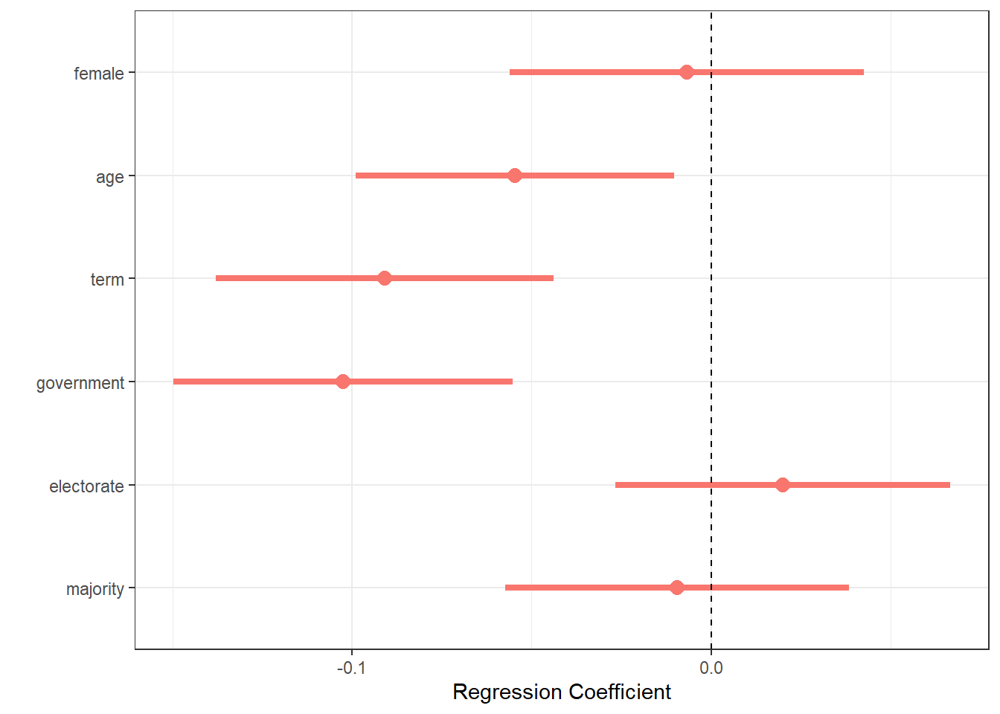
```

---
## Analysing Users &mdash; Who has the most followers?

```{r, echo = FALSE, out.width = "70%", fig.align = "center"}
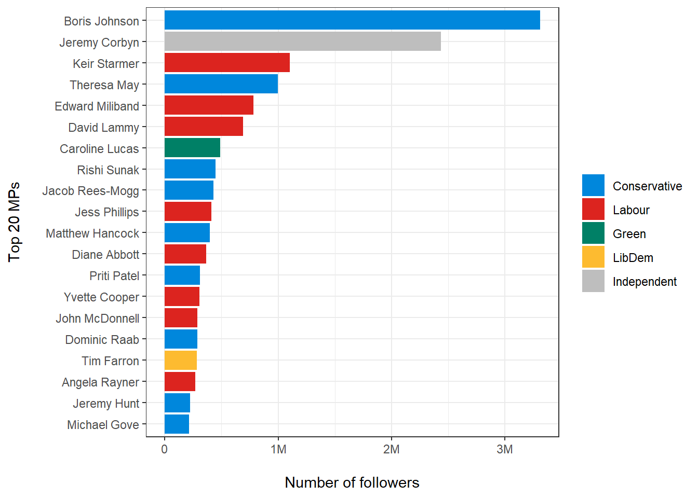
```

---
## Analysing Users &mdash; Correlates of having more followers

```{r, echo = FALSE, out.width = "70%", fig.align = "center"}
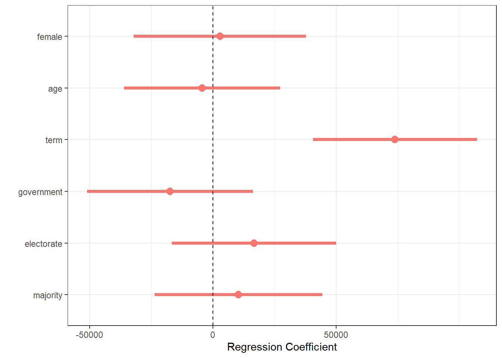
```

---
## Analysing Users &mdash; Who tweets the most often?

```{r, echo = FALSE, out.width = "70%", fig.align = "center"}
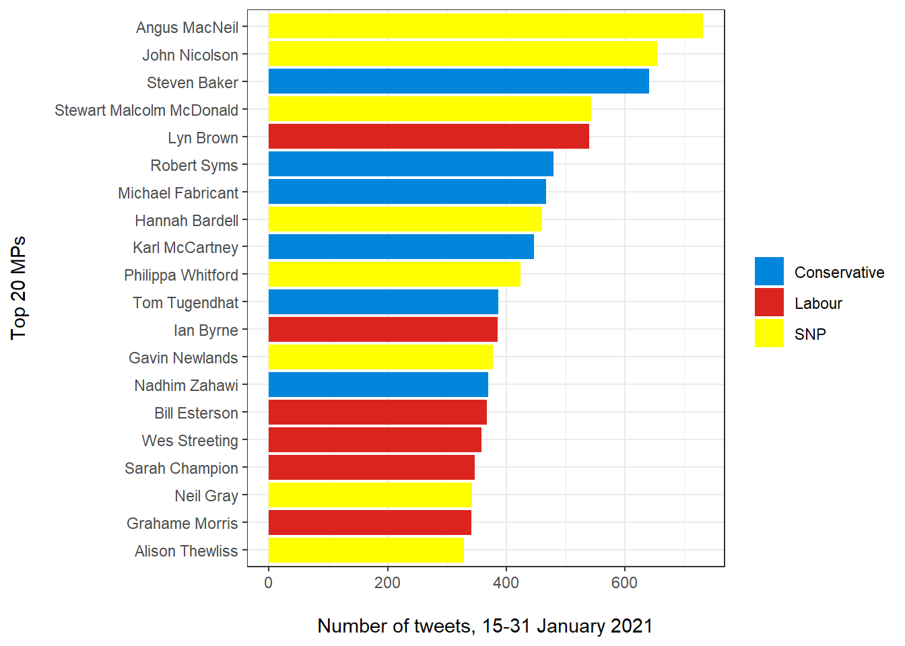
```

---
## Analysing Users &mdash; Correlates of tweeting more often

```{r, echo = FALSE, out.width = "70%", fig.align = "center"}
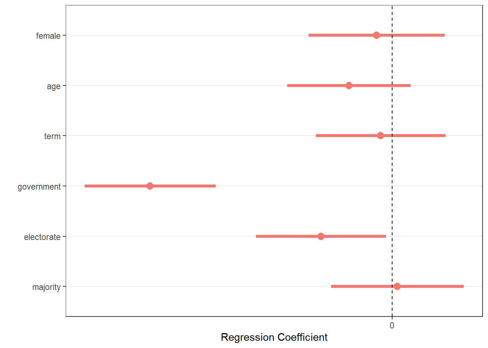
```

---
## Analysing Users &mdash; Who do they talk to?

```{r, echo = FALSE, out.width = "70%", fig.align = "center"}
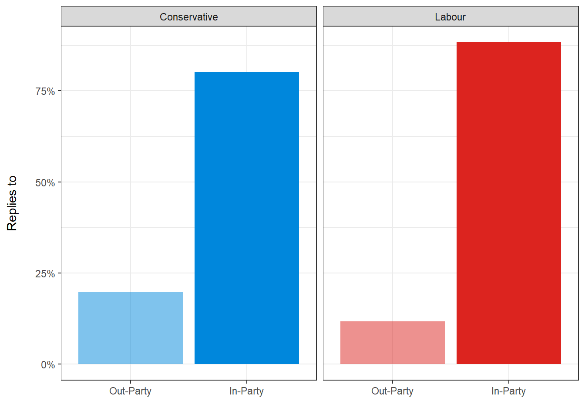
```

---
class: action

## Exercises

On `users.Rmd`, complete the following exercises

52) Correlates of being on Twitter

53) Who has the most followers?

54) Correlates of having more followers

55) Who tweets the most often?

56) Correlates of tweeting more often

57) Who do they talk to?

`r countdown(minutes = 45, seconds = 00, top = 0)`

---
class: center, middle

# Network Analysis

---
## Analysing Users &mdash; Network Analysis &mdash; Overview

- Twitter data is suitable for network analysis

  - a social network
  - studying the relations between users

<br>

- There are at least five networks

   - networks of followers
       - directed, .yellow-h[not] reoccurring 
       - e.g., who is following whom     
<br>
   - networks of retweeters, quoters, repliers, and likers
       - directed, reoccurring
       - e.g., who is replying to whom, .yellow-h[how often]

---
## Analysing Users &mdash; Network Analysis &mdash; Basics

- Networks are composed of nodes and edges
   
   - e.g., who (a node) replies (an edge) to whom (another node), how often (the strength of the edge)
   
--

<br>

- The nodes and edges are often kept separate for analysis
    
  - e.g., in separate datasets, frames
  - nodes are given an ID number
  
--

<br>

- We will use two pacakges for network analysis
   
   - `tidygraph` for data manipulation
   - `ggraph` for visualisation
  
---
## Analysing Users &mdash; Network Analysis &mdash; `tidygraph`

.pull-left[
```{r, eval=FALSE}
read_rds("data/tweets.rds") %>%
  filter(is_retweet == TRUE) %>% 
  group_by(screen_name, retweet_screen_name) %>%
  summarise(replies = n()) %>% 
  head()

```

]

.pull-right[

.out-t[

<pre class="tab">
&#x23; A tibble: 6 x 3    
&#x23; Groups:   screen_name [1]     
  screen_name  retweet_screen_name   rts
  <chr>        <chr>               <int>
1 _OliviaBlake AlexDaviesJones         1
2 _OliviaBlake CommonsPAC              2
3 _OliviaBlake DanJarvisMP             3
4 _OliviaBlake DrRosena                1
5 _OliviaBlake EmmaHardyMP             1
6 _OliviaBlake FriendsLoxley           2
</pre>        

]

]
---
## Analysing Users &mdash; Network Analysis &mdash; `tidygraph`

.pull-left[

Use the `as_tbl_graph` function transform data frames

```{r, eval=FALSE}
read_rds("data/tweets.rds") %>%
  filter(is_retweet == TRUE) %>% 
  group_by(screen_name, retweet_screen_name) %>%
  summarise(replies = n()) %>% 
  `as_tbl_graph()`

```

]

.pull-right[

.out-t[

<pre class="tab">
&#x23; A tbl_graph: 7377 nodes and 16131 edges
&#x23;
&#x23; A directed multigraph with 5 components
&#x23;
&#x23; Node Data: 7,377 x 1 (active)
  name         
  <chr>        
1 _OliviaBlake 
2 _RobbieMoore 
3 AaronBell4NUL
4 ab4scambs    
5 abenaopp     
6 ABridgen     
&#x23; ... with 7,371 more rows
&#x23;
&#x23; Edge Data: 16,131 x 3
   from    to   rts
  <int> <int> <int>
1     1    19     1
2     1   550     2
3     1   119     3
&#x23; ... with 16,128 more rows
</pre>        

]

]

---
## Analysing Users &mdash; Network Analysis &mdash; `tidygraph`

.pull-left[

Use the `activate` function manipulate the nodes or edges

```{r, eval=FALSE}
read_rds("data/tweets.rds") %>%
  filter(is_retweet == TRUE) %>% 
  group_by(screen_name, retweet_screen_name) %>%
  summarise(rts = n()) %>% 
  as_tbl_graph() %>% 
  `activate(edges)` %>%
  `mutate(multi_rts = if_else(rts > 1, 1, 0))`

```

]

.pull-right[

.out-t[

<pre class="tab">
&#x23; A tbl_graph: 7377 nodes and 16131 edges
&#x23;
&#x23; A directed multigraph with 5 components
&#x23;
&#x23; Edge Data: 16,131 x 4 (active)
   from    to   rts multi_rts
  <int> <int> <int>    <dbl>
1     1    19     1        0
2     1   550     2        1
3     1   119     3        1
4     1   154     1        0
5     1   167     1        0
6     1   551     2        1
&#x23; ... with 16,125 more rows
&#x23;
&#x23; Node Data: 7,377 x 1
  name         
  <chr>        
1 _OliviaBlake 
2 _RobbieMoore 
3 AaronBell4NUL
&#x23; ... with 7,374 more rows

</pre>        

]

]

---
## Analysing Users &mdash; Network Analysis &mdash; `ggraph`


Once the nodes and edges are ready, use the `ggraph` package to visualise

   - an extension of `ggplot2`
   - many verbs are intuitively similar

```{r, eval=FALSE}

ggraph(rt_network) +
  geom_edge_link() +
  geom_node_point(aes(color = party)) +
  theme_graph()

```

---
## Analysing Users &mdash; Reply networks

```{r, echo = FALSE, out.width = "70%", fig.align = "center"}
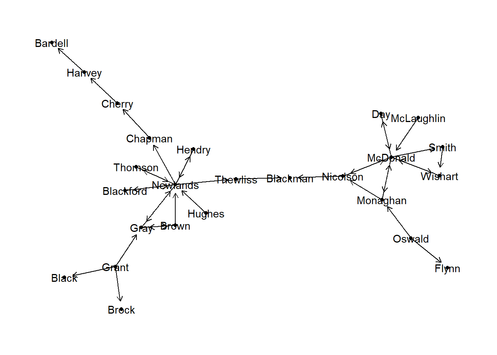
```

---
## Analysing Users &mdash; Retweet networks

```{r, echo = FALSE, out.width = "70%", fig.align = "center"}
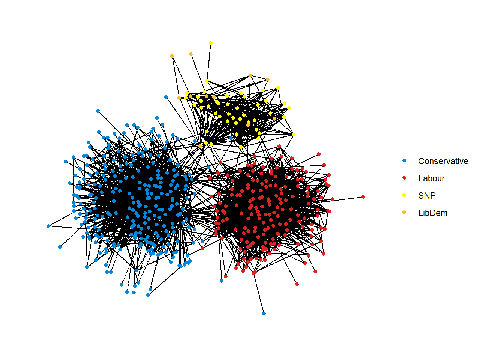
```

---
## Analysing Users &mdash; Who are more central in the retweet networks?

```{r, echo = FALSE, out.width = "70%", fig.align = "center"}
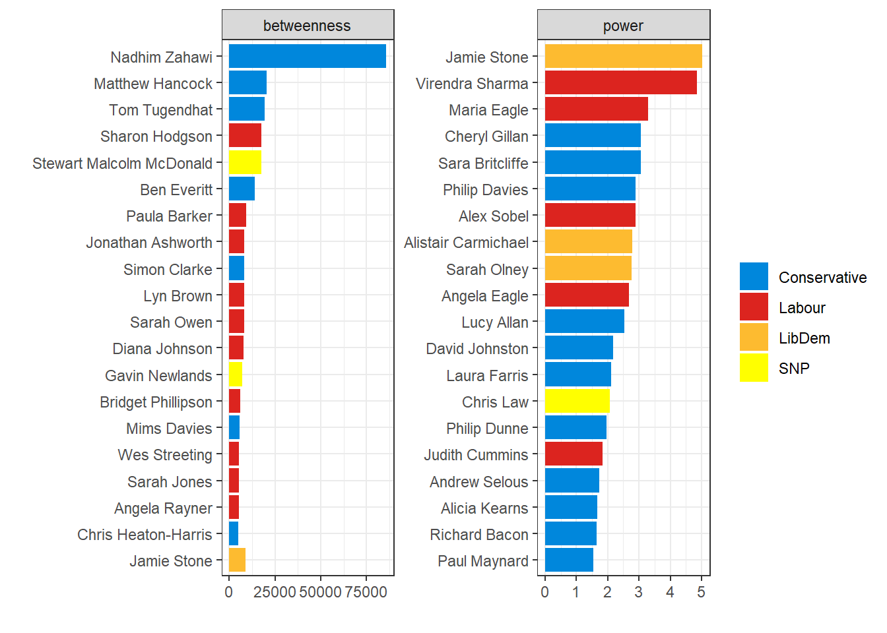
```

---
class: action

## Exercises

On `users.Rmd`, complete the following exercises

58) Reply networks

59) Retweet networks

60) Who are more central in the retweet networks?

61) Something else interesting about MPs

63) Something interesting from your own data

`r countdown(minutes = 45, seconds = 00, top = 0)`

---
name: part6
class: inverse, center, middle

# Part 6. Data Anaysis: Tweets

.footnote[

[Back to the contents slide](#contents-slide).

]

---
## Analysing Tweets &mdash; Overview

- Twitter analysis often focuses on tweets

  - e.g., text in the tweets, but also hashtags
  - as opposed to users who tweet them
      - not always mutually exclusive
  - hard to supplement ordinary users with non-Twitter data

--

<br>

- There are at least two types of tweet-based analysis

   - count things, and describe or correlate
      - e.g., how often a hashtag is tweeted
         - are shorter hashtags more likely to be tweeted than longer ones?
    - categorising tweets
      - e.g., with dictionaries
         - but also with other techniques such as machiene learning

---
## Analysing Tweets &mdash; When were the tweets posted?

```{r, echo = FALSE, out.width = "70%", fig.align = "center"}
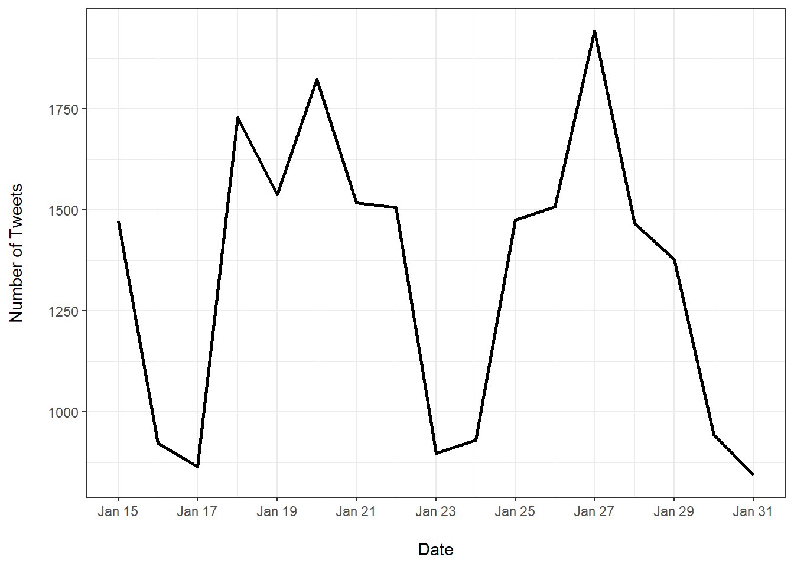
```

---
## Analysing Tweets &mdash; What day of the week?

```{r, echo = FALSE, out.width = "70%", fig.align = "center"}
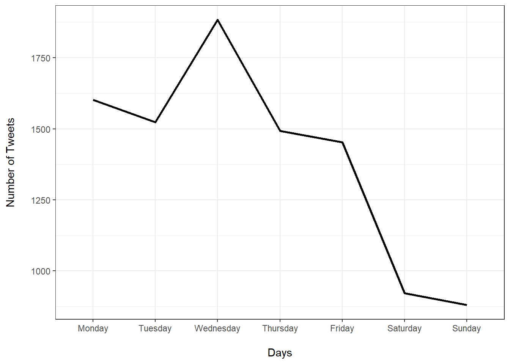
```

---
## Analysing Tweets &mdash; What time of the day?

```{r, echo = FALSE, out.width = "70%", fig.align = "center"}
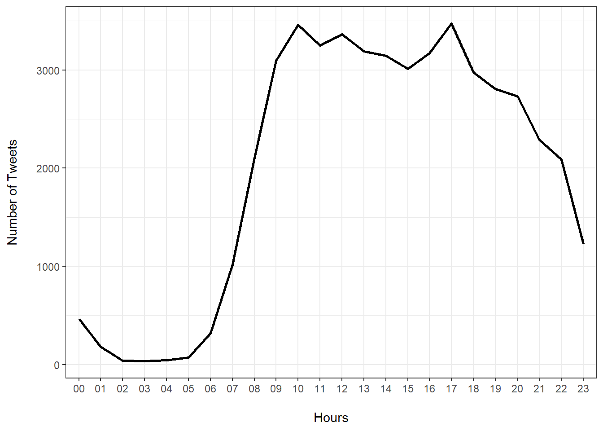
```

---
## Analysing Tweets &mdash; Which hastags were the most frequent?

```{r, echo = FALSE, out.width = "70%", fig.align = "center"}
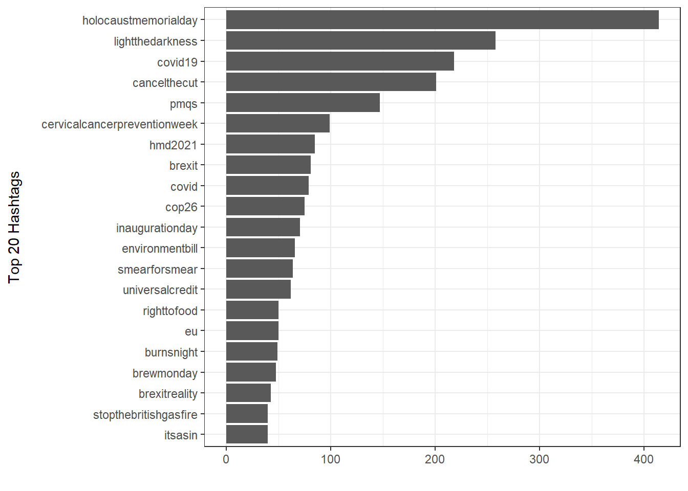
```

---
## Analysing Tweets &mdash; Which words were the most frequent?

```{r, echo = FALSE, out.width = "70%", fig.align = "center"}
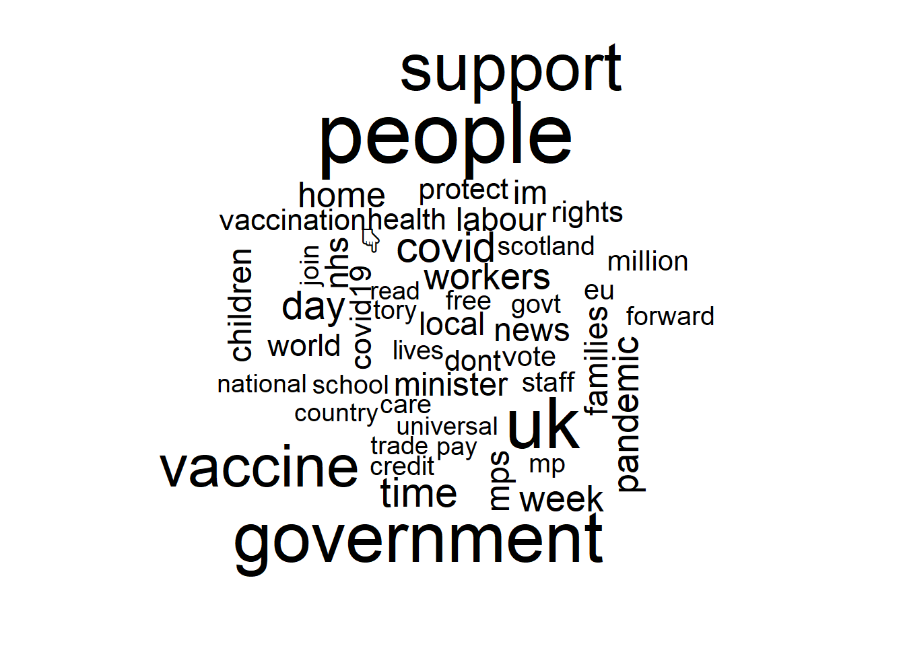
```

---
## Analysing Tweets &mdash; Sentiments by Hours of the Day

```{r, echo = FALSE, out.width = "70%", fig.align = "center"}
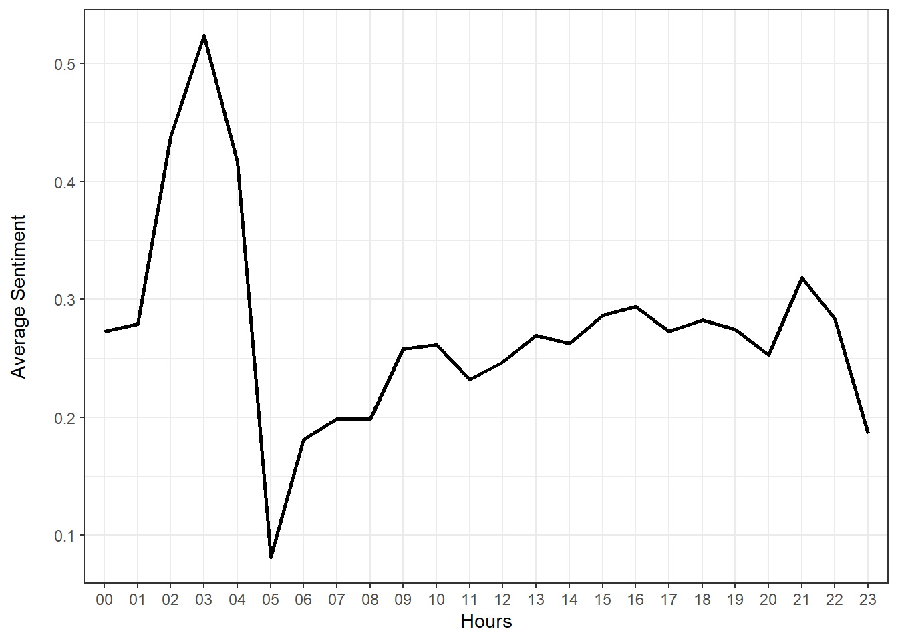
```

---
class: action

## Exercises

On `tweets.Rmd`, complete the following exercises

63) When were the tweets posted?

64) What day of the week?

65) What time of the day?

66) Which hastags were the most frequent?

67) Which words were the most frequent?

68) Sentiments by Hours of the Day

`r countdown(minutes = 45, seconds = 00, top = 0)`


---
class: center, middle

# Dictionary Methods

---
## Analysing Users &mdash; Dictionary Methods &mdash; Overview

- Dictionary methods are based on pre-categorisation of words

  - e.g., the word happy might be categorised as positive
      - sad would be negative
      
  - e.g., the word happy might be categorised as 0.2 sophisticated
      - contented might be 0.4 sophisticated

--

<br>

- These catagories are than matched with the text we have
   
  - to calculate scores for, e.g., each tweet

---
## Analysing Users &mdash; Dictionary Methods &mdash; Notes

- There are many ways to calculate scores

   - depending on your research design

<br>

- Positive score could be

   - `sum(positive)`
   - `sum(positive) - sum(negative)`
   - `(sum(positive) - sum(negative)) / (sum(positive) + sum(negative))`
   
- We will use 
   
  - the sentiment dictionary stored at `tidytext::get_sentiments("nrc")`
  - the concreteness dictionary stored at `doc2concrete::mturk_list`

---

## Analysing Tweets &mdash; Sentiments across the time frame

```{r, echo = FALSE, out.width = "70%", fig.align = "center"}
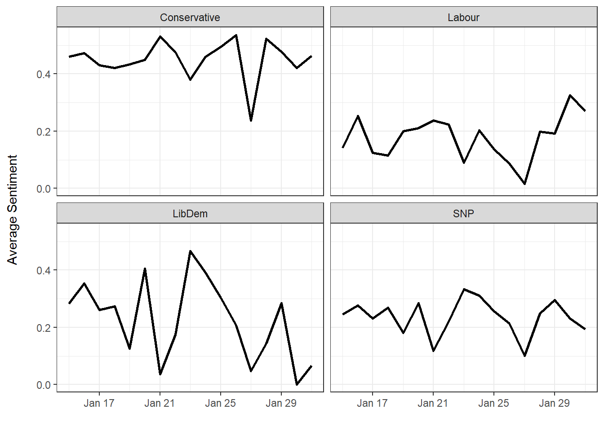
```

---
## Analysing Tweets &mdash; Sentiments in different types of tweets

```{r, echo = FALSE, out.width = "70%", fig.align = "center"}
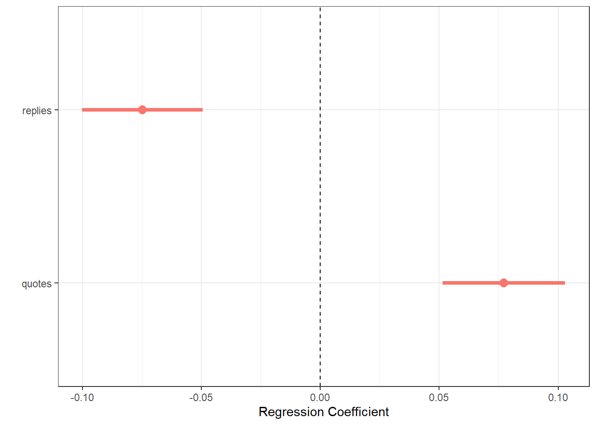
```

---
## Analysing Tweets &mdash; Concreteness in different types of tweets

```{r, echo = FALSE, out.width = "70%", fig.align = "center"}
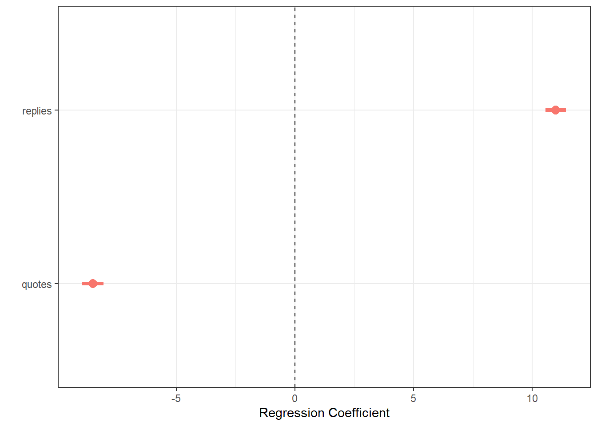
```

---
## Analysing Tweets &mdash; Concreteness by Hours of the Day

```{r, echo = FALSE, out.width = "70%", fig.align = "center"}
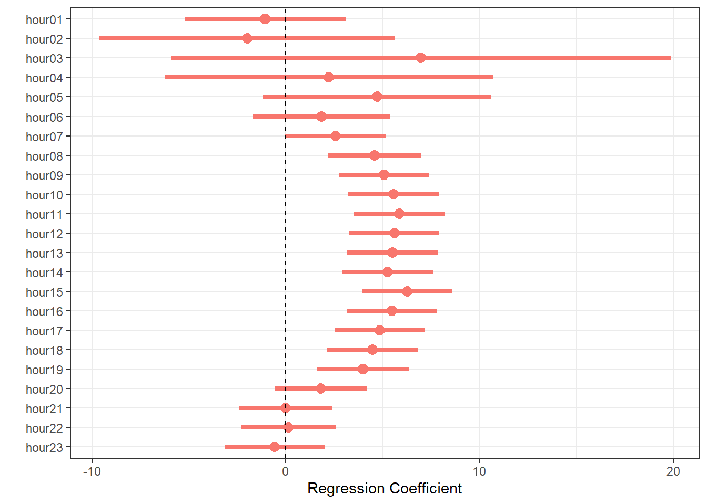
```

---
class: action

## Exercises

On `tweets.Rmd`, complete the following exercises

69) Sentiments across the time frame

70) Sentiments in different types of tweets

71) Concreteness in different types of tweets

72) Concreteness by Hours of the Day

73) Something else interesting about MPs

74) Something interesting from your own data

`r countdown(minutes = 45, seconds = 00, top = 0)`

---
name: part7
class: inverse, center, middle

# Part 7. Data Anaysis: Machiene Learning

.footnote[

[Back to the contents slide](#contents-slide).

]

---
name: part8
class: inverse, center, middle

# Part 8. Next Steps

.footnote[

[Back to the contents slide](#contents-slide).

]

---
class: action

## Twitter &mdash; Apply for a Developer Account

- On [developer.twitter.com](https://developer.twitter.com/), click `Apply`
   - at the top-right corner of the page<sup>*</sup>
   - follow the instructions on consecutive pages    

.footnote[

<sup>*</sup>It takes a few days for Twitter to review and hopefully approve your request to have an account. You might have created an account before. In that case, you will see `Developer Portal` instead of `Apply`. 

]

---
class: action

## Twitter &mdash; Apply for a Developer Account

- On [developer.twitter.com](https://developer.twitter.com/), click `Apply`
   - at the top-right corner of the page<sup>*</sup>
   - follow the instructions on consecutive pages    

<br>

- Write a detailed case for your intended use of Twitter APIs
       - not just that you are attending this workshop
       - a quick application is likely to slow the review process
          - as Twitter often asks for more details via email
       - rejection is also a possibility    

<br>

- Carefully review the Twitter's [Developer Agreement and Policy](https://developer.twitter.com/en/developer-terms/agreement-and-policy)
       - especially important if you will develop an app that
           - others will use
           - will write as well as read Twitter data

---
class: action

## Twitter &mdash; Register an App

- On [developer.twitter.com/en/portal/projects-and-apps](https://developer.twitter.com/en/portal/projects-and-apps), click `+ Create App`
   - follow the instructions on consecutive pages
       - you will need a unique name for your app
       
  - note that, once the app is registered, you are provided with keys and tokens
      - you will use these for authentication
          - if you choose not to authenticate through `rtweet`'s own app, called `rstats2twitter`
          - more on this in [Part 3](#part3)
          
- does not mean you have to create an actual app
    - e.g., an app for smart phones

---
## Twitter &mdash; Keys and Tokens &mdash; Notes          
      
- Keys and tokens are personal
   - should not be shared with others
      - e.g., through replication files, when asking a question on [Stack Overflow](https://stackoverflow.com/) 

--
          
- Keys and tokens can be re-generated anytime
  - on your applications page, under the `Keys and tokens` tab
  - this requires updating your R script with the new tokens as well
  
--

- Twitter allows for further, optional settings involving keys and tokens
   - relevant, mostly, for apps to do more than just collecting tweets
   - e.g., settings for 3-legged OAuth
      - like `rstats2twitter`, to allow for other users to authenticate through a browser pop up
   - not covered in this workshop
   
---
## Twitter &mdash; Keys and Tokens &mdash; Notes &mdash; Definitions

- Consumer key and Consumer secret

  - identifiers for an application
  - provide .yellow-h[project authorization]
     - identify the application
     - check whether the application has been granted access
  - like your application's username and password

--

- Access token and Access token secret

  - identifier for users of an application
     - this may or may not include anyone other than the owner
     - e.g., for `rstats2twitter`, there are many users
  - provide .yellow-h[user authentication] 
     - identify the user
     - check whether the user should have access to a request
     
---
## Data Collection &mdash; `rtweet` &mdash; Authentication

There are two different methods of [authentication](https://developer.twitter.com/en/docs/authentication/overview)   
<br>   
- through `rtweet`'s `rstats2twitter` app
      
  - the app makes requests on your behalf
  - you simply approve this, via a browser that pops up
  - nice and easy, but comes with some limitations  
  
--

<br>  
      
- through your own app   
      
  - you make requests on your behalf
  - through your own app that you register as a developer 
  - takes a little effort, but comes with additional stability and functionality
        - removing the dependency on `rstats2twitter`, over which you have no control
        - getting rid of the pop up windows   
        - not only for collecting tweets, but also posting your own tweets
              - and, reading and writing your own direct messages


---
name: create-token
class: action

## Data Collection &mdash; Define Your Token

If you are using your own app to authenticate, create a token
- using the `create_token` function
- the `app` argument requires for the name of your own app, as registered on [developer.twitter.com](https://developer.twitter.com/)
- the other arguments to be filled with the information from the `Keys and tokens` tab on the same website


```{r, eval=FALSE}
tw_token <- create_token(
    app = "",
    consumer_key = "",
    consumer_secret = "",
    access_token = "",
    access_secret = ""
  )
```

---
## Data Collection &mdash; Define Your Token &mdash; Alternatives

.pull-left[
- You may wish to put your keys and tokens elsewhere
   - they are personal, just like a password

- There are at least two alternatives
   - .yellow-h[create a separate script, which you can then `source` at the top of your main script]
   
]
   
.pull-right[

`keys_tokens.R`

```{r, eval=FALSE}
 tw_token <- create_token(
    app = "",
    consumer_key = "",
    consumer_secret = "",
    access_token = "",
    access_secret = ""
   )
```


`data_collection.R`

```{r, eval=FALSE}
 library(rtweet)
 `source("keys_tokens.R")`
```

]

---
## Data Collection &mdash; Define Your Token &mdash; Alternatives

.pull-left[
- You may wish to put your keys and tokens elsewhere
   - they are personal, just like a password

- There are at least two alternatives
   - create a separate script, which you can then `source` at the top of your main script
   
   - .yellow-h[store your keys and tokens in your `.Renviron` file, which can be created at the project level as well]
   
]
   
.pull-right[

`.Renviron`

```{r, eval=FALSE}
TWITTER_APP=name_of_my_app
TWITTER_CONSUMER_KEY=akN...
TWITTER_CONSUMER_SECRET=HJK...
TWITTER_ACCESS_TOKEN=345...
TWITTER_ACCESS_SECRET=SDF...
```


`data_collection.R`

```{r, eval=FALSE}
 library(rtweet)
tw_token <- create_token(
    app = Sys.getenv("TWITTER_APP"),
    consumer_key = Sys.getenv("TWITTER_CONSUMER_KEY"),
    consumer_secret = Sys.getenv("TWITTER_CONSUMER_SECRET"),
    access_token = Sys.getenv("TWITTER_ACCESS_TOKEN"),
    access_secret = Sys.getenv("TWITTER_ACCESS_SECRET")
 )
```

]
     
---
name: reference-slide
class: inverse, center, middle

# References

.footnote[

[Back to the contents slide](#contents-slide).

]

---
## References

Benoit, K., Watanabe, K., Wang, H., Nulty, P., Obeng, A., Müller, S., Matsuo, A., Lua, J. W., Kuha, J., & Lowe, W. (2020). [quanteda: Quantitative Analysis of Textual Data](https://cran.r-project.org/web/packages/quanteda/index.html). R package, version 2.1.2.

Cheng, J., & Chang, W. (2020). [httpuv: HTTP and WebSocket Server Library](https://cran.r-project.org/web/packages/httpuv/index.html). R package, version 1.5.4.

Gentry, J. (2015). [twitteR: R Based Twitter Client](https://cran.r-project.org/web/packages/twitteR/index.html). R package, version 1.1.9.

Jungherr, A. (2016). [Twitter use in election campaigns: A systematic literature review](https://doi.org/10.1080/19331681.2015.1132401). Journal of Information Technology & Politics, 13(1), 72&ndash;91.

Jürgens, P. & Jungherr, A. (2016). A Tutorial for Using Twitter Data in the Social Sciences: Data Collection, Preparation, and Analysis (January 5, 2016). Available at <http://dx.doi.org/10.2139/ssrn.2710146>.

Mellon, J., & Prosser, C. (2017). [Twitter and Facebook are not representative of the general population: Political attitudes and demographics of British social media users](https://doi.org/10.1177%2F2053168017720008). Research & Politics, July-September 2017, 1&ndash;9.

Robinson, D., & Silge, J. (2021). [tidytext: Text mining using 'dplyr', 'ggplot2', and other tidy tools](https://cran.r-project.org/web/packages/tidytext/index.html). R package, version 0.3.0.

Sievert, C., Parmer, C.,  Hocking, T., Chamberlain, S., Ram, K., Corvellec, M., & Despouy, P. (2020). [plotly: Create Interactive Web Graphics via 'plotly.js'](https://cran.r-project.org/web/packages/plotly/index.html). R package, version 4.9.3.

---
## References

Silge, J., & Robinson, D. (2017). [Text mining with R: A tidy approach](https://www.tidytextmining.com). O'Reilly. Open access at

Silva, B. C., & Proksch, S. O. (2020). [Fake It 'Til You Make It: A Natural Experiment to Identify European Politicians' Benefit from Twitter Bots](https://doi.org/10.1017/S0003055420000817). American Political Science Review, 1-7.

Sinnenberg, L., Buttenheim, A. M., Padrez, K., Mancheno, C., Ungar, L., & Merchant, R. M. (2017). [Twitter as a tool for health research: A systematic review](https://doi.org/10.2105/AJPH.2016.303512). American Journal of Public Health, 107(1), 1&ndash;8.

Umit, R. (2017). [Strategic communication of EU affairs: An analysis of legislative behaviour on Twitter](https://doi.org/10.1080/13572334.2017.1283166). Journal of Legislative Studies, 23(1), 93&ndash;124.

Wickham, H. (2019). [stringr: Simple, Consistent Wrappers for Common String Operations](https://cran.r-project.org/web/packages/stringr/index.html). R package, version 1.4.0.

Wickham, H., Chang, W., Henry, L., Pedersen, T. L., Takahashi, K., Wilke, C., Woo, K., Yutani, H. and Dunnington, D. (2020). [dplyr: A grammar of data manipulation](https://cran.r-project.org/web/packages/dplyr/index.html). R package, version 0.8.5.

Wickham, H. and Grolemund, G. (2019). [R for data science](https://r4ds.had.co.nz). O'Reilly. Open access at [https://r4ds.had.co.nz](https://r4ds.had.co.nz/).

Wickham, H., RStudio (2019). [https://cran.r-project.org/web/packages/tidyverse/index.html](tidyverse: Easily Install and Load the 'Tidyverse'). R package, version 3.3.3.

Xie, Y. (2020). [xaringan: Presentation Ninja](https://cran.r-project.org/web/packages/xaringan/index.html). R package, version 0.19.

---
class: middle, center

## The workshop ends here.
## Congradulations for making it this far, and
## thank you for joining me!

.footnote[

[Back to the contents slide](#contents-slide).

]
